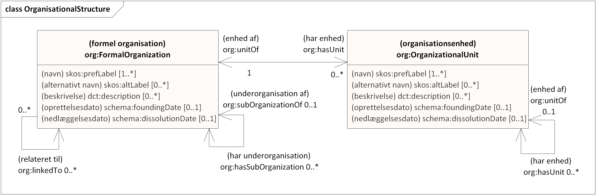
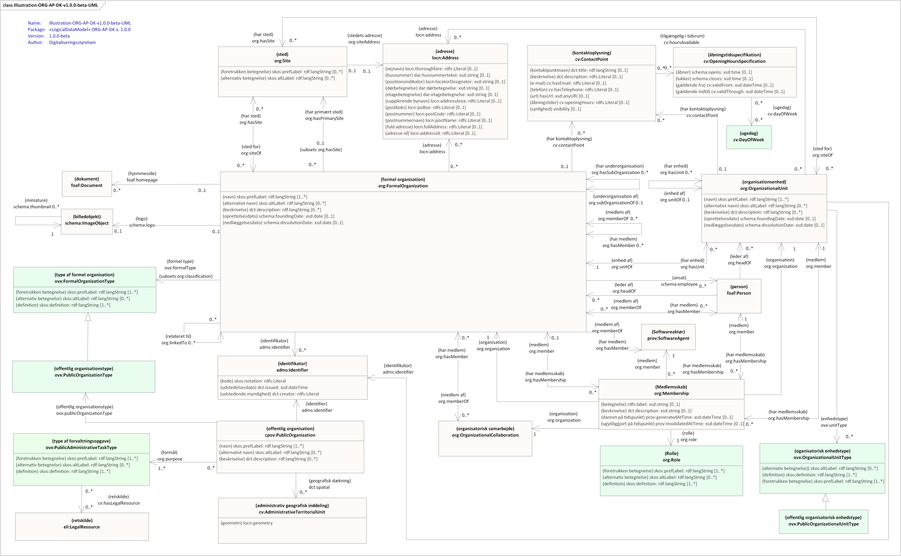
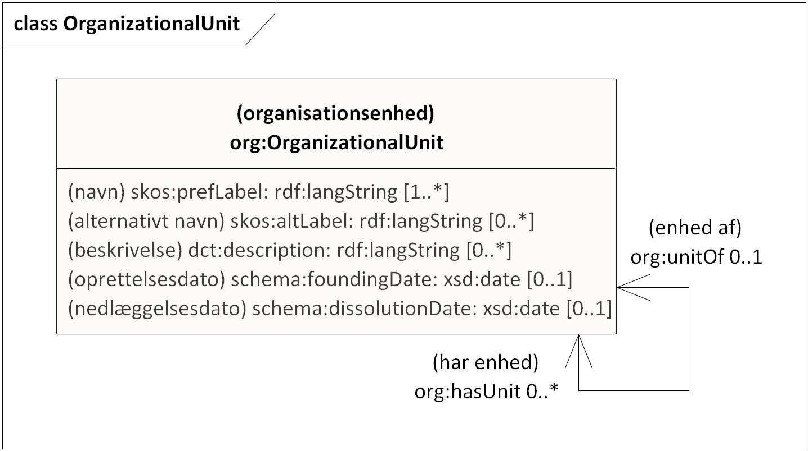
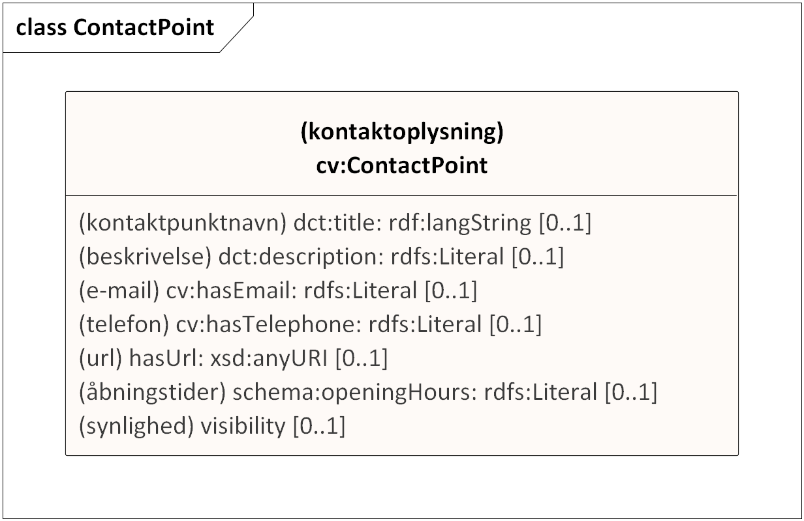
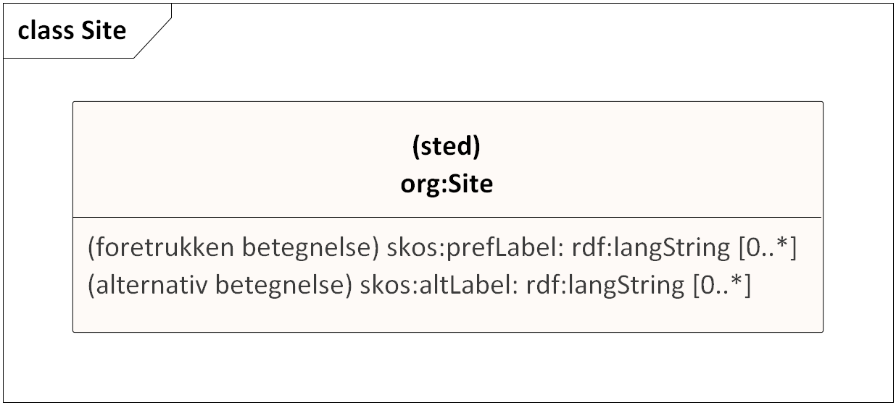
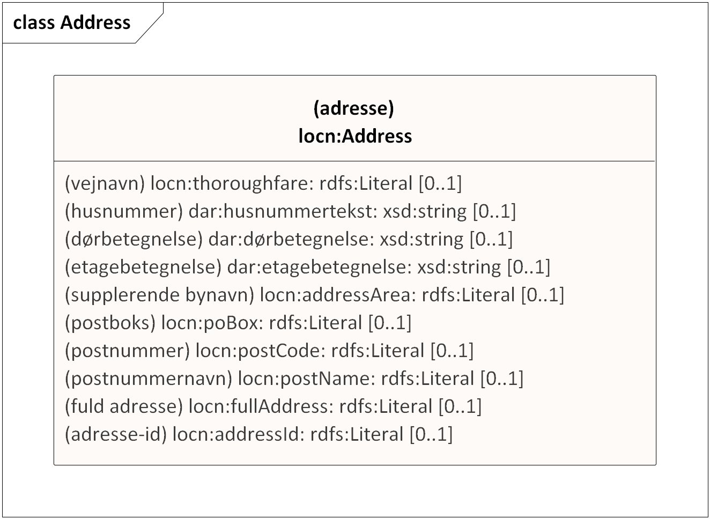

<pre class="metadata">
Title: ORG-AP-DK 1.0.0-beta
Status: LD
URL: https://data.gov.dk/model/profile/ORG-AP-DK/
Editor Term: Udgiver, Udgivere 
Editor: Digitaliseringsstyrelsen,, arkitektur@digst.dk
Abstract: 'ORG-AP-DK 1.0.0-beta' .
Boilerplate: copyright no, conformance no, abstract no
Shortname: ORG-AP-DK
Revision: 1.0.0-beta 
Date: 2021-11-05
Max ToC Depth: 3
Markup Shorthands: markdown yes
Repository: digst/ORG-AP-DK
Translation: en https://digst.github.io/ORG-AP-DK/docs/index-en.html
Inline Github Issues: full
Logo: digst...
</pre>

<h1>UDKAST TIL ORG-AP-DK 1.0.0-beta: Anvendelseprofil for organisation </h1>

#  Introduktion
Dette dokument introducerer modellering af organisationer og definerer en anvendelsesprofil baseret på internationale standarder. Anvendelsesprofilen udgør en fælles model for offentlige såvel som ikke-offentlige organisationer i en dansk administrativ og fællesoffentlig kontekst.

## Formål
Data om organisationer, private eller offentlige, er de helt grundlæggende oplysninger om organisationers navn, struktur, placering, opgaver, mv. Disse data indgår i mange forskellige sammenhænge i offentlige løsninger. Ved at etablere en fælles standard for opbygning og udstilling af data om både private og offentlige organisationer opnås ikke blot et fælles sprog og en fælles struktur, men grundstenene sættes også for større deling og genbrug af data om organisationer.

## Baggrund
Anvendelsesprofilen ORG-AP-DK udarbejdes i tæt koordiering og samarbejde med KL og en referencegruppe bestående af deltagere fra kommuner, regioner og statslige myndigheder som udarbejder en beskrivelse af de forretningsmæssige behov samt bagvedliggende informationsmodel.

Anvendelsesprofilen baseres på internationale standarder. Særligt bidrager de internationale vokabularer [The Organization Ontology (ORG)](https://www.w3.org/TR/vocab-org/) og [Core Public Organisation Vocabulary (CPOV)](https://joinup.ec.europa.eu/release/core-public-organisation-vocabulary-v100) med centrale klasser og egenskaber. ORG-AP-DK er en nærmere specifikation af, hvordan de internationale modeller skal forstås og anvendes – i denne sammenhæng til modellering af data vedrørende organisationer og myndigheder i dansk fællesoffentlig kontekst. 

## Metode
Anvendelsesprofilen er oprettet i henhold de [Fællesoffentlige regler for begrebs- og datamodellering](https://arkitektur.digst.dk/metoder/regler-begrebs-og-datamodellering), og sammensætter således eksisterende vokabularer til en bestemt anvendelse. Teknologisk udspringer de anvendte og foreslåede modeller af Semantic Web/Linked Dataverdenens modelleringsgrundlag, Resource Description Framework (RDF). En basal forståelse af RDF samt kendskab til de her profilerede vokabularer er et godt udgangspunkt for arbejdet med anvendelsesprofilen. ORG og CPOV foreligger i danske oversættelser. Disse oversatte dokumenter udgør normative referencer for den i efterfølgende opstillede anvendelsesprofil.

## Profilens anvendelse

Indsæt reference til KLs brugsscenarier.
Brugsscenarierne er inddelt i en række perspektiver som beskrives nærmere i næste afsnit.

	

# Grundlæggende perspektiver

Det aktuelle udkast omfatter ikke alle ovenstående perspektiver endnu, men vi arbejder løbende på at opdatere modellen.

## Organisation
- Det grundlæggende vokabular, ORG, definerer bredt **organisation** som *”[…] en samling mennesker, der er organiseret i et fællesskab eller anden social, kommerciel eller politisk struktur. Gruppen har et vist fælles formål eller eksistensberettigelse, der rækker ud over det sæt af personer, der tilhører den. En organisation kan i sig selv fungere som aktør.”*
- En **formel organisation** beskrives af ORG som *”en organisation, der – især i juridisk forstand – er bredt anerkendt og har tilhørende rettigheder og ansvar. Eksempler kan være et aktieselskab eller en velgørende, statslig eller kirkelig forening”.*
- En **offentlig organisation** beskrives af CPOV som *”enhver organisation, der er defineret som værende en del af den offentlige sektor under en juridisk ramme på ethvert niveau”.*

## Basisinformation
- En organisation tilføjes en eller flere navne. En af navnene på et givet sprog vil være organisationens **primære, juridiske navn**, men andres kan angives som **alternative eller skjulte navne**.
- En organisation kan forsynes med en **tekstbaseret beskrivelse** af organisationen 
- En organisation kan have en billedlig repræsentation i form at et **logo og en miniature**.
- En organisation kan kædes sammen med dens **hjemmeside** på internettet.
- En organisation kan forsynes med en **identifikator** - Til identifikation af en dansk offentlig organisation kan en myndighedskode anvendes. Kommunekoder og regionskoder udgør begge delmængder af myndighedskoder. Juridiske enheder kan identificeres med brug af et CVR-nummer. 

[Se eksempel her](https://digst.github.io/ORG-AP-DK/releases/v.1.0/docs/#eksempel-p-basisinformation)

	
## Organisatorisk struktur
- En organisation kan bestå af flere **underorganisationer** der hver for sig har en specifik identitet, fx kan et ministerium bestå af flere underordnede styrelser.
- En organisation kan være inddelt i mindre **organisationsenheder** hvis eksistens er afhængig af organisationen, fx en afdeling i en større organisation. Organisationer består typisk af mange afdelinger, kontorer, enheder, teams, grupper osv.
- Organisationer kan indbyrdes have **andre former for relationer** end de der udtrykkes i form af under- og overorganisatoriske forhold, fx finansiering eller kæderelationer.
<!--
- En organisation kan klassificeres som værende af en bestemt **organisationstype**. I forhold til offentlige organisationer kunne det fx være kommune, region, ministerier, styrelser og mange af de andre former for offentlige organisationer, der er en væsentlig del af hverdagen i det offentlige organisationslandskab. -->

[Se eksempel her](https://digst.github.io/ORG-AP-DK/releases/v.1.0/docs/#eksempel-p-organisatoriske-strukturer)

## Kontaktinformation
- En organisation eller en organisationsenhed kan oprette et **kontaktpunkt** som kan gives et **navn** der formidler kontaktpunktets formål.
- Et kontaktpunkt kan tilknyttes **telefonnummer**, **e-mailadresse**, **url**, herunder Digital Post, gennem hvilken man kan kontakte organisationen eller en repræsentant for organisationen. 
- Et kontaktpunkt kan også levere information om dets **åbningstider** - enten på simpel vis eller i en mere komplekks struktur med yderligere begrænsninger. 

[Se eksempel her](https://digst.github.io/ORG-AP-DK/releases/v.1.0/docs//#eksempel-p-kontaktinformation)

## Sted
- En organisations fysiske placering kan angives. Placeringen kan fx angives med en adresse.
- Det kan angives hvilket administrativt geografisk område en offentlig organisation dækker forvaltningsmæssigt.
<!-- En organisation kan også have en virtuel lokation -->
	
## Medlemsskab og aktører
- En persons relation til en organisation kan beskrives som en medlemskabsrelation. En organisations relation til en anden organisation kan også have karakter af et medlemskab. En person ansat i en organisation kan betragtes som medlem af organisationen. I forhold til et givet medlemskab kan spiller aktøren i forhold til organisationen en rolle, som kan specificeres i en klassifikation over rolletyper.
- En organisations relationer til personer i form af ansatte og ledere kan også angives direkte.

Relation til Non-Person Entities /It-systemer bør indføres.

Det aktuelle udkast omfatter endnu ikke beskrivelser af jobfunktioner og delegering af opgaver i organisationen.

	
## Historik og retsgrundlag
- En organisation oprettes og ændres som svar på begivenheder eller hændelser. Dette kan være resultatet af ny lovgivning, ny politik eller at den påtager sig nye forpligtelser mv. En given ændring eller oprettelse kan således kædes sammen med den lovgivning, den politik eller anden retskilde, der udløste eller ligger til grund for hændelsen.
- En organisations oprettelse eller nedlæggelse kan beskrives og denne kan ske på et specifikt tidspunkt eller over en periode.
- Både overordnede organisatoriske ændringer og interne omstruktureringer kan rummes af modellen.
- En offentlig organisation beskrives med et organisatorisk formål, der antages altid at være en forvaltningsopgave. Til dette formål anvendes en klassifikation over forvaltningsopgaver.
	    
	    
# Globalt unikke og stabile identifikatorer	    
Formelle organisationer og organisationsenheder skal identificeres med en unik, stabil og tværgående identifikator der er uafhængig af det system den er skabt i. Derved kan organisationsdata opmærket med organisationsstandarden identificeres unikt på tværs af it-løsninger og organisatoriske skel. 
	    
Der er et generelt behov for at kunne sammenstille organisationsdata fra forskellige kilder og forretningsdata opmærket med organisationsdata på en sikker og nem måde. Det betyder, at der er behov for at de relevante organisationer og enheder er opmærket med en unik, tværgående identifikator. 
	    
Den tværgående identifikator ændres ikke i hele entitetens livstid. Oprettes en f.eks en ny organisationsenhed som erstatning for en tidligere enhed med samme navn, gives den nye en ny unik identifikator. Identifikatoren kan altid efter tildeling anvendes til at finde entiteten. 

Til dette anvendes en eksisterende global og bredt anvendt syntaks - URIer (Uniform Resource Identifiers). URI-specifikationen definerer en fælles syntaks for identificering og adressering af ressourcer som på internettet. Læs mere om unikke og stabile identifikatorer i [https://www.ietf.org/rfc/rfc3986.txt](RFC 4646) [FAIR-principperne](https://www.go-fair.org/fair-principles/), [EU 10 Rules for Persistent URIs](https://joinup.ec.europa.eu/collection/semantic-interoperability-community-semic/document/10-rules-persistent-uris) samt [Retningslinjer for stabile http-urier](https://arkitektur.digst.dk/node/588).

Udover den globalt unikke URI, forsynes organisationer også ofte med andre identifikatorer som udstedes til forskellige formål af specifikke myndigheder, fx. myndighedskoder og CVR-nummer som denne specifikation også kan rumme. 
	    

# Navneområder
<table class="term-table">
<thead><tr><th>præfiks</th><th>navneområde</th><th>titel</th></tr></thead><tbody>
 <tr><td>org-ap-dk </td><td>https://data.gov.dk/model/profile/organisation/</td><td>Anvendelsesprofil for organisation</td></tr>	
 <tr><td>org </td><td>http://www.w3.org/ns/org# </td><td>Organization Ontology </td></tr>
 <tr><td>cpov </td><td>http://data.europa.eu/m8g/ </td><td>Core Public Organization Vocabulary </td></tr>
 <tr><td>foaf </td><td>http://xmlns.com/foaf/0.1/ </td><td>Friend of a Friend </td></tr>
 <tr><td>skos </td><td>http://www.w3.org/2004/02/skos/core# </td><td>Simple Knowledge Organization System </td></tr>
 <tr><td>dct </td><td>http://purl.org/dc/terms/ </td><td>Dublin Core Metadata Terms </td></tr>
 <tr><td>prov </td><td>http://www.w3.org/ns/prov# </td><td>The PROV Ontology </td></tr>
 <tr><td>locn </td><td>http://www.w3.org/ns/locn#   </td><td>Location Core Vocabulary </td></tr>
 <tr><td>cpsv </td><td>http://data.europa.eu/cv/ </td><td>Core Public Service Vocabulary </td></tr>
 <tr><td>eli </td><td>http://data.europa.eu/eli/ontology# </td><td>European Legislation Identifier </td></tr>
 <tr><td>schema </td><td>http://schema.org/ </td><td>Schema.org </td></tr>
 <tr><td>rdf </td><td>http://www.w3.org/1999/02/22-rdf-syntax-ns# </td><td>Resource Description Framework </td></tr>
 <tr><td>rdfs </td><td>http://www.w3.org/2000/01/rdf-schema# </td><td>RDF Schema </td></tr>
 <tr><td>owl </td><td>http://www.w3.org/2002/07/owl# </td><td>Web Ontology Language </td></tr>
 <tr><td>xsd </td><td>http://www.w3.org/2001/XMLSchema#  </td><td>XML Schema </td></tr>
 <tr><td>dagi </td><td>https://data.gov.dk/model/profile/cvr# </td><td>Grunddatamodel for Det Centrale Virksomhedsregister </td></tr>
 <tr><td>dar </td><td>https://data.gov.dk/model/profile/dar# </td><td>Grunddatamodel for Danmarks Adresser  </td></tr>
 <tr><td>cvr </td><td>https://data.gov.dk/model/profile/dagi# </td><td>Grunddatamodel for Danmarks Administrative Geografiske Inddeling</td></tr>
 <tr><td>ovx </td><td>https://data.gov.dk/model/organization/extension# </td><td>Organization Vocabulary Extension </td></tr>
</tbody></table>

</table>

#  Gældende krav og overensstemmelse
ORG-AP-DK 1.0.0 er er baseret på og anvender dermed klasser og egenskaber fra [The Organization Ontology (ORG)](https://www.w3.org/TR/vocab-org/) og [Core Public Organisation Vocabulary (CPOV)](https://joinup.ec.europa.eu/release/core-public-organisation-vocabulary-v100) 

## Kravniveauer
I ORG-AP-DK anvender følgende kravniveauer. 

* **Obligatorisk** (Mandatory): informationen SKAL angives
* **Anbefalet** (Recommended): informationen BØR angives hvis den er tilgængelig
* **Valgfri** (Optional): informationen KAN angives  

I det aktuelle udkast er der endnu ikke taget stilling til kravniveau.

# UML-diagrammer

<!--
### Diagram med obligatoriske elementer (minimumsmodel)
### Diagram med obligatoriske og anbefalede elementer
-->

## Diagram med alle elementer
Den fulde anvendelsesprofil ORG-AP-DK v.1.0.0-beta visualiseret med UML-diagram  (alle obligatoriske, anbefalede og valgfrie elementer).

#  Elementer i ORG-AP-DK
I det følgende præsenteres alle egenskaberne i ORG-AP-DK per klasse.

## Formel organisation

<dl class="def">
<dt>URI</dt>
<dd>http://www.w3.org/ns/org#FormalOrganization </dd>
<dt>Foretrukken term (da)</dt>
<dd>formel organisation</dd>	
<dt>Alternativ term (da)</dt>
<dd>organisation</dd>		
<dt>Anvendelsesnote (da) </dt>
<dd>organisation der er formelt anerkendt i samfundet med tilhørende rettigheder og ansvar </dt>
<dt>Anvendelsesnote (en) </dt>
<dd>organization which is recognized in the world at large with associated rights and responsibilities</dd>
<!--
<dt>Definition (da) </dt>
<dd>En organisation, der – især i juridisk forstand – er bredt anerkendt og har tilhørende rettigheder og ansvar. Eksempler kan være et aktieselskab eller en velgørende, statslig eller kirkelig forening.</dt>
<dt>Definition (en) </dt>
<dd>An Organization which is recognized in the world at large, in particular in legal jurisdictions, with associated rights and responsibilities. Examples include a corporation, charity, government or church.</dd>
-->
<dt>Specialisering af</dt>
<dd>http://www.w3.org/ns/org#Organization </dd>
<dt>Kravniveau</dt>
<dd>Obligatorisk</dd>
</dl>	 

Klassens egenskaber:	

### navn

<dl class="def">
<dt>URI</dt>
<dd>http://www.w3.org/2004/02/skos/core#prefLabel</dd>
<dt>Foretrukken term (da)</dt>
<dd>navn</dd>	
<dt>Alternativ term (da)</dt>
<dd>foretrukken term</dd>	
<dt>Anvendelsesnote (da) </dt>
<dd>Bruges til at angive organisationens primære -ofte juridisk anerkendte - navn. Det antages at organisationer kun har et sådant navn på hvert sprog. Primære navne kan angives på flere sprog med flere forekomster af egenskaben skos:prefLabel. </dt>
<dt>Anvendelsesnote (en) </dt>
<dd>Used to provide the primary - often legally recognised - name of the organization. An organization may only have one such name in any given language. Primary names may be provided in multiple languages with multiple instances of the preferred label property.</dd>	
<!--
<dt>Definition (da) </dt>
<dd>Den foretrukne leksikalske betegnelse for en ressource på et givet sprog. </dt>
<dt>Definition (en) </dt>
<dd>The preferred lexical label for a resource, in a given language. </dd>
-->
<dt>Udfaldsrum</dt>
<dd>rdf:PlainLiteral</dd>
<dt>Underegenskab af</dt>
<dd>rdfs:label </dd>
<dt>Kravniveau</dt>
<dd>Obligatorisk</dd>
</dl>

### alternativt navn

<dl class="def"><dt>URI</dt>  
<dd>http://www.w3.org/2004/02/skos/core#altLabel</dd>  
<dt>Foretrukken term på dansk</dt>  
<dd>alternativt navn</dd>  
<dt>Alternativ term på dansk</dt>  
<dd>alternativ betegnelse</dd>  	
<dt>Foretrukken term på engelsk</dt>  
<dd>alternative label</dd>  
<dt>Anvendelsesnote (da) </dt>
<dd>Bruges til at angive et accepteret - men ikke foretrukkent - navn for organisationen</dt>	
<dt>Anvendelsesnote (en) </dt>
<dd>Used to provide an accepted - not not preferred - name for the organisation</dt>	
<!--
<dt>Definition på dansk</dt>  
<dd>en alternativ leksikalsk betegnelse for en ressource</dd>  
<dt>Definition på engelsk</dt>  
<dd>An alternative lexical label for a resource.</dd>  

<dt>Defineret af</dt>  
<dd>http://www.w3.org/2004/02/skos/core#</dd>  
<dt>Udfaldsrum:</dt>
<dd>rdf:langString</dd>
-->
<dt>Multiplicitet</dt>
<dd>[0..*]</dd>
</dl>

### beskrivelse 
<dl class="def"><dt>URI</dt>  
<dd>http://purl.org/dc/elements/1.1/description</dd>  
<dt>Foretrukken term på dansk</dt>  
<dd>beskrivelse</dd>  
<dt>Foretrukken term på engelsk</dt>  
<dd>description</dd>  
<dt>Anvendelsesnote (da) </dt>
<dd>Bruges til at angive en tekstbaseret beskrivelse af organisationens formål og arbejde</dt>	
<dt>Anvendelsesnote (en) </dt>
<dd>Used to provide a textual description of the purpose and avtivity of the organisation</dt>	
<!--
<dt>Definition på dansk</dt>  
<dd>en forklaring af en ressource</dd>  
<dt>Definition på engelsk</dt>  
<dd>An account of the resource. </dd>  
-->
<dt>Defineret af</dt>  
<dd>http://purl.org/dc/elements/1.1/</dd>  
<dt>Udfaldsrum:</dt>
<dd>rdf:langString</dd>
<dt>Multiplicitet</dt>
<dd>[0..*]</dd>
</dl>

### oprettelsesdato
<dl class="def"><dt>URI</dt>  
<dd>http://schema.org/foundingDate</dd>  
<dt>Foretrukken term på dansk</dt>  
<dd>oprettelsesdato</dd>  
<dt>Alternativ betegnelse (da)</dt>
<dd>grundlæggelsesdato</dd>		
<dt>Foretrukken term på engelsk</dt>  
<dd>founding date</dd>  
<dt>Anvendelsesnote (da) </dt>
<dd>Bruges til at angive den dato hvorpå organisationen blev oprettet</dt>	
<dt>Anvendelsesnote (en) </dt>
<dd>Used to specifying the date on which the organisation was created</dt>
<!--
<dt>Definition på dansk</dt>  
<dd>den dato organisationen blev oprettet</dd>  
<dt>Definition på engelsk</dt>  
<dd>The date that this organization was founded.</dd>  
-->
<dt>Defineret af</dt>  
<dd>http://schema.org/</dd>  
<dt>Udfaldsrum:</dt>
<dd>xsd:date</dd>
<dt>Multiplicitet</dt>
<dd>[0..1]</dd>
</dl>

### nedlæggelsesdato
<dl class="def"><dt>URI</dt>  
<dd>http://schema.org/dissolutionDate </dd>  
<dt>Foretrukken term på dansk</dt>  
<dd>nedlæggelsesdato</dd>	
<dt>Alternativ betegnelse (da)</dt>	
<dd>opløsningsdato</dd>  
<dt>Foretrukken term på engelsk</dt>  
<dd>dissolution date</dd>  
<dt>Anvendelsesnote (da) </dt>
<dd>Bruges til at angive den dato hvorpå organisationen blev nedlagt</dt>	
<dt>Anvendelsesnote (en) </dt>
<dd>Used to specifying the date on which the organisation was dissolved</dt>	
<!--
<dt>Definition på dansk</dt>  
<dd>den dato organisationen blev nedlagt</dd>  
<dt>Definition på engelsk</dt>  
<dd>The date that this organization was dissolved. </dd>  
-->
<dt>Defineret af</dt>  
<dd>http://schema.org/</dd>  
<dt>Udfaldsrum:</dt>
<dd>xsd:date</dd>-->
<dt>Multiplicitet</dt>
<dd>[0..1]</dd>
</dl>

### identifikator

<dl class="def"><dt>URI</dt>  
<dd></dd>  
<dt>Foretrukken term på dansk</dt>  
<dd>identifikator</dd>  
<dt>Foretrukken term på engelsk</dt>  
<dd>identifier</dd>  
<dt>Anvendelsesnote (da) </dt>
<dd></dt>	
<dt>Anvendelsesnote (en) </dt>
<dd></dt>	
<dt>Defineret af</dt>  
<dd>http://www.w3.org/ns/adms#</dd>  
<dt>Udfaldsrum:</dt>
<dd>http://www.w3.org/ns/adms#Identifier</dd>
<dt>Multiplicitet</dt><dd>[0..*]</dd>  
</dl> 

se også https://digst.github.io/ORG-AP-DK/releases/v.1.0/docs/#globalt-unikke-og-stabile-identifikatorer

### er underorganisation af 
<dl class="def"><dt>URI</dt>  
<dd>http://www.w3.org/ns/org#subOrganizationOf</dd>  
<dt>Foretrukken term på dansk</dt>  
<dd>er underorganisation af</dd>  
<dt>Foretrukken term på engelsk</dt>  
<dd>sub-organization of</dd>  
<dt>Anvendelsesnote (da) </dt>
<dd>Bruges til at angive en organisation som omfatter denne organisation. Bemærk at denne undeorganisation har en selvstændig eksistens - modsat en organisationsenhed</dt>	
<dt>Anvendelsesnote (en) </dt>
<dd>Used to specifying an organisation which contains this organisation. Note that this sub-organisation has an independent eksistence - unlike an organisational unit</dt>	<!--	
<dt>Definition på dansk</dt>  
<dd>Repræsenterer hierarkisk indhold af organisationer eller organisatoriske enheder. Den angiver en organisation, som omfatter denne organisation. </dd>  
<dt>Definition på engelsk</dt>  
<dd>Represents hierarchical containment of Organizations or OrganizationalUnits; indicates an Organization which contains this Organization. Inverse of `org:hasSubOrganization`. </dd>  
-->
<dt>Defineret af</dt>  
<dd>http://www.w3.org/ns/org#</dd>  
<dt>Udfaldsrum:</dt>
<dd>http://www.w3.org/ns/org#FormalOrganization</dd>
<dt>Multiplicitet</dt><dd>[0..1]</dd>  
</dl>  

### har underorganisation 
<dl class="def"><dt>URI</dt>  
<dd>http://www.w3.org/ns/org#hasSubOrganization </dd>  
<dt>Foretrukken term på dansk</dt>  
<dd>har underorganisation</dd>  
<dt>Foretrukken term på engelsk</dt>  
<dd>has sub-organization</dd>
<dt>Anvendelsesnote (da) </dt>
<dd>Bruges til at angive en organisation som er omfattet af denne organisation</dt>	
<dt>Anvendelsesnote (en) </dt>
<dd>Used to specifying an organisation which contain this organisation/dt>	
<!--	
<dt>Definition på dansk</dt>  
<dd>Repræsenterer hierarkisk indhold af organisationer eller organisatoriske enheder. Den angiver en organisation, som er en del eller et barn af denne organisation. </dd>  
<dt>Definition på engelsk</dt>  
<dd>Represents hierarchical containment of Organizations or Organizational Units; indicates an organization which is a sub-part or child of this organization. Inverse of `org:subOrganizationOf`. </dd>  
-->
<dt>Defineret af</dt>  
<dd>http://www.w3.org/ns/org#</dd>
<dt>Udfaldsrum:</dt>
<dd>http://www.w3.org/ns/org#FormalOrganization</dd>
<dt>Multiplicitet</dt><dd>[0..*]</dd>  
</dl>  

### har enhed 
<dl class="def"><dt>URI</dt>  
<dd>http://www.w3.org/ns/org#hasUnit </dd>  
<dt>Foretrukken term på dansk</dt>  
<dd>har enhed</dd>  
<dt>Foretrukken term på engelsk</dt>  
<dd>has unit </dd>  
<!--
<dt>Definition på dansk</dt>  
<dd>Angiver en enhed, som er del af denne organisation, f.eks. en afdeling i en større organisation </dd>  
<dt>Definition på engelsk</dt>  
<dd>Indicates a unit which is part of this Organization, e.g. a Department within a larger FormalOrganization. Inverse of `org:unitOf` </dd>  
-->
<dt>Defineret af</dt>  
<dd>http://www.w3.org/ns/org#</dd>  
<dt>Udfaldsrum:</dt>
<dd>http://www.w3.org/ns/org#OrganizationalUnit</dd>
<dt>Multiplicitet</dt>
<dd>[0..*]</dd>  
</dl>  

### relateret til  
<dl class="def"><dt>URI</dt>  
<dd>http://www.w3.org/ns/org#linkedTo</dd>  
<dt>Foretrukken term på dansk</dt>  
<dd>relateret til</dd>  
<dt>Foretrukken term på engelsk</dt>  
<dd>linked to</dd>  
<dt>Definition på dansk</dt>  
<dd>Angiver en arbitrær relation mellem to organisationer. </dd>  
<dt>Definition på engelsk</dt>  
<dd>Indicates an arbitrary relationship between two organizations. </dd>  
<dt>Kommentar på dansk</dt>  
<dd>Specialiseringer af denne kan f.eks. bruges til at angive finansiering eller kæderelationer. </dd>  
<dt>Kommentar på engelsk</dt>  
<dd>Specializations of this can be used to, for example, denote funding or supply chain relationships. </dd>  
<dt>Defineret af</dt>  
<dd>http://www.w3.org/ns/org#</dd>  
<dt>Multiplicitet</dt>
<dd>[0..*]</dd>  
<dt>Udfaldsrum</dt>
<dd>http://www.w3.org/ns/org#FormalOrganization</dd></dl>  

### hjemmeside  
<dl class="def"><dt>URI</dt>  
<dd>http://xmlns.com/foaf/0.1/homepage</dd>  
<dt>Foretrukken term på dansk</dt>  
<dd>hjemmeside</dd>  
<dt>Foretrukken term på engelsk</dt>  
<dd>homepage</dd>  
<dt>Definition på dansk</dt>  
<dd>en hjemmeside for noget</dd>  
<dt>Definition på engelsk</dt>  
<dd>A homepage for some thing. </dd>  
<dt>Defineret af</dt>  
<dd>http://xmlns.com/foaf/0.1/</dd>  
<dt>Multiplicitet</dt><dd>[0..*]</dd>  
<dt>Udfaldsrum</dt><dd>http://xmlns.com/foaf/0.1/WebPage</dd></dl>  

### logo  
<dl class="def"><dt>URI</dt>  
<dd>http://schema.org/logo </dd>  
<dt>Foretrukken term på dansk</dt>  
<dd>logo</dd>  
<dt>Foretrukken term på engelsk</dt>  
<dd>logo</dd>  
<dt>Definition på dansk</dt>  
<dd>et tilknyttet logo</dd>  
<dt>Definition på engelsk</dt>  
<dd>An associated logo.</dd>  
<dt>Defineret af</dt>  
<dd>http://schema.org/</dd>  
<dt>Multiplicitet</dt><dd>[0..1]</dd>  
<dt>Udfaldsrum</dt><dd>ttp://schema.org/ImageObject</dd></dl>  
 

## Organisationsenhed

<dl class="def">  
<dt>URI</dt>  
<dd>http://www.w3.org/ns/org#OrganizationalUnit</dd>  
<dt>Foretrukken term på dansk</dt>  
<dd>organisationsenhed</dd> 
<dt>Alternativ betegnelse (da)</dt>	
<dd>organisatorisk enhed</dd>  	
<dt>Foretrukken term på engelsk</dt>  
<dd>organizational unit</dd>  
<dt>Anvendelsesnote (da) </dt>
<dd>Bruges til at beskrive en enhed som er del af en større organisation og kun har en fuld anerkendelse i forbindelse med den organisation. Organisationer består typisk af mange organisationsenheder som såsom afdelinger, kontorer, enheder, teams, grupper osv. </dt>		
<dt>Anvendelsesnote (en) </dt>
<dd>Used for describing a unit which is part of some larger organization and only has full recognition within the context of that organization. Typically, organisations consist of many organisational units such as deparments, divisions, units, teams, groups etc. </dt>		
<!--
<dt>Definition på dansk</dt>  
<dd>En organisation som en afdeling eller en supportenhed, der er del af en større organisation og kun har fuld anerkendelse i forbindelse med den organisation. Det gælder især, at enheden ikke i sig selv kan opfattes som en juridisk enhed. </dd>  
<dt>Definition på engelsk</dt>  
<dd>An Organization such as a department or support unit which is part of some larger Organization and only has full recognition within the context of that Organization. In particular the unit would not be regarded as a legal entity in its own right. </dd>  
-->
<dt>Defineret af</dt>  
<dd>http://www.w3.org/ns/org#</dd>  
<dt>Specialisering af </dt>
<dd>http://www.w3.org/ns/org#Organization </dd>
<dt>Kravniveau</dt>
<dd>Valgfri</dd>
</dl>  

### navn

<dl class="def">
<dt>URI</dt>
<dd>http://www.w3.org/2004/02/skos/core#prefLabel</dd>
<dt>Foretrukken term (da)</dt>
<dd>navn</dd>	
<dt>Alternativ term (da)</dt>
<dd>foretrukken term</dd>	
<dt>Anvendelsesnote (da) </dt>
<dd>Bruges til at angive organisationsenhedens primære navn. Det antages at organisationsenheder kun har et sådant navn på hvert sprog. Primære navne kan angives på flere sprog med flere forekomster af egenskaben skos:prefLabel. </dt>
<dt>Anvendelsesnote (en) </dt>
<dd>Used to provide the primary name of the organizationak unit. An organizational unit may only have one such name in any given language. Primary names may be provided in multiple languages with multiple instances of the preferred label property.</dd>	
<!--
<dt>Definition (da) </dt>
<dd>Den foretrukne leksikalske betegnelse for en ressource på et givet sprog. </dt>
<dt>Definition (en) </dt>
<dd>The preferred lexical label for a resource, in a given language. </dd>
-->
<dt>Udfaldsrum</dt>
<dd>rdf:PlainLiteral</dd>
<dt>Underegenskab af</dt>
<dd>rdfs:label </dd>
<dt>Kravniveau</dt>
<dd>Obligatorisk</dd>
</dl>

### alternativt navn

<dl class="def"><dt>URI</dt>  
<dd>http://www.w3.org/2004/02/skos/core#altLabel</dd>  
<dt>Foretrukken term på dansk</dt>  
<dd>alternativt navn</dd>  
<dt>Alternativ term på dansk</dt>  
<dd>alternativ betegnelse</dd>  	
<dt>Foretrukken term på engelsk</dt>  
<dd>alternative label</dd>  
<dt>Anvendelsesnote (da) </dt>
<dd>Bruges til at angive et accepteret - men ikke foretrukkent - navn for organisationsenheden</dt>	
<dt>Anvendelsesnote (en) </dt>
<dd>Used to provide an accepted - not not preferred - name for the organizational unit</dt>	
<!--
<dt>Definition på dansk</dt>  
<dd>en alternativ leksikalsk betegnelse for en ressource</dd>  
<dt>Definition på engelsk</dt>  
<dd>An alternative lexical label for a resource.</dd>  

<dt>Defineret af</dt>  
<dd>http://www.w3.org/2004/02/skos/core#</dd>  
<dt>Udfaldsrum:</dt>
<dd>rdf:langString</dd>
-->
<dt>Multiplicitet</dt>
<dd>[0..*]</dd>
</dl>

### beskrivelse 
<dl class="def"><dt>URI</dt>  
<dd>http://purl.org/dc/elements/1.1/description</dd>  
<dt>Foretrukken term på dansk</dt>  
<dd>beskrivelse</dd>  
<dt>Foretrukken term på engelsk</dt>  
<dd>description</dd>  
<dt>Anvendelsesnote (da) </dt>
<dd>Bruges til at angive en tekstbaseret beskrivelse af organisationsenhedens formål og arbejde</dt>	
<dt>Anvendelsesnote (en) </dt>
<dd>Used to provide a textual description of the purpose and avtivity of the organizational unit</dt>	
<!--
<dt>Definition på dansk</dt>  
<dd>en forklaring af en ressource</dd>  
<dt>Definition på engelsk</dt>  
<dd>An account of the resource. </dd>  
-->
<dt>Defineret af</dt>  
<dd>http://purl.org/dc/elements/1.1/</dd>  
<dt>Udfaldsrum:</dt>
<dd>rdf:langString</dd>
<dt>Multiplicitet</dt>
<dd>[0..*]</dd>
</dl>

### oprettelsesdato

### nedlæggelsesdato

### er enhed af
<dl class="def"><dt>URI</dt>  
<dd>http://www.w3.org/ns/org#unitOf </dd>  
<dt>Foretrukken term på dansk</dt>  
<dd>enhed af</dd>  
<dt>Foretrukken term på engelsk</dt>  
<dd>unit of</dd>  
<dt>Anvendelsesnote (da)</dt>  
<dd>Angiver en organisation eller en organisationsenhed, som denne enhed er en del af </dd>  
<dt>Anvendelsesnote (en)</dt>  
<dd>Indicates an organization or organizational unit of which this unit is a part </dd>  
<dt>Defineret af</dt>  
<dd>http://www.w3.org/ns/org#</dd>  
<dt>Multiplicitet</dt><dd>[0..1]</dd>  
<dt>Rækkevidde</dt><dd>http://www.w3.org/ns/org#FormalOrganization & http://www.w3.org/ns/org#OrganizationalUnit</dd></dl>  

### har enhed 
<dl class="def"><dt>URI</dt>  
<dd>http://www.w3.org/ns/org#hasUnit </dd>  
<dt>Foretrukken term på dansk</dt>  
<dd>har enhed</dd>  
<dt>Foretrukken term på engelsk</dt>  
<dd>has unit </dd>  
<dt>Anvendelsesnote (da) </dt>
<dd>Bruges til at angive en organisationsenhed som er en del af denne organisationsenhed</dt>	
<dt>Anvendelsesnote (en) </dt>
<dd>Used to specifying an organizational unit which is a part of this organizational unit/dt>	
<dt>Defineret af</dt>  
<dd>http://www.w3.org/ns/org#</dd>  
<dt>Udfaldsrum:</dt>
<dd>http://www.w3.org/ns/org#OrganizationalUnit</dd>
<dt>Multiplicitet</dt>
<dd>[0..*]</dd>  
</dl>  

## Offentlig organisation

<dl class="def">
<dt>URI</dt>
<dd>http://data.europa.eu/m8g/PublicOrganisation </dd>
<dt>Foretrukken betegnelse (da)</dt>
<dd>offentlig organisation</dd>		
<dt>Anvendelsesnote (da) </dt>
<dd>Bruges til at beskrive organisationer der defineres som værende en del af den offentlige sektor under en juridsk ramme på ethvert niveau</dd>
<dt>Anvendelsesnote (en)</dt>
<dd>Used for describing organisations that are defined as being part of the public sector by a legal framework at any level </dd>

<dt>Definition (da) </dt>
<dd>Any Organization that is defined as being part of the public sector by a legal framework at any level.</dt>
<dt>Definition (en) </dt>
<dd>Enhver organisation, der er defineret som værende en del af den offentlige sektor under en juridisk ramme på ethvert niveau.</dd>	

<dt>Specialisering af </dt>
<dd>http://www.w3.org/ns/org#Organization </dd>
<dt>Kravniveau</dt>
<dd>Valgfri</dd>
</dl>	 
Klassens egenskaber:	

-->

## Kontaktpunkt 

<dl class="def">  
<dt>URI</dt>  
<dd>http://schema.org/ContactPoint</dd>  
<dt>Foretrukken term på dansk</dt>  
<dd>kontaktpunkt</dd>  
<dt>Foretrukken term på engelsk</dt>  
<dd>contact point</dd>  
<dt>Definition på dansk</dt>  
<dd>Et kontaktpunkt - eksempelvis en Kundeklageafdeling</dd>  
<dt>Definition på engelsk</dt>  
<dd>A contact point—for example, a Customer Complaints department. </dd>  
<dt>Anvendelsesnote på dansk</dt>  
<dd>Dette er en klasse, der repræsenterer et kontaktpunkt for organisationen</dd>  
<dt>Defineret af</dt>  
<dd>http://schema.org/</dd>  
</dl>  
 
  
<strong>Datatypeegenskaber (attributter): </strong>  

### kontakpunktnavn  
<dl class="def"><dt>URI</dt>  
<dd>https://schema.org/contactType</dd>  
<dt>Foretrukken term på dansk</dt>  
<dd>kontakttype</dd>  
<dt>Foretrukken term på engelsk</dt>  
<dd>contact type</dd>  
<dt>Definition på dansk</dt>  
<dd>denne egenskab anvendes til at klassificere kontaktpunkter</dd>  
<dt>Definition på engelsk</dt>  
<dd>A person or organization can have different contact points, for different purposes. For example, a sales contact point, a PR contact point and so on. This property is used to specify the kind of contact point.</dd>  
<dt>Defineret af</dt>  
<dd>https://schema.org/</dd>  
<dt>Rækkevidde:</dt><dd>rdf:langString</dd><dt>Multiplicitet</dt><dd>[0..1]</dd></dl>

### telefonnummer
<dl class="def"><dt>URI</dt>  
<dd>http://schema.org/telephone </dd>  
<dt>Foretrukken term på dansk</dt>  
<dd>telefon</dd>  
<dt>Foretrukken term på engelsk</dt>  
<dd>telephone</dd>  
<dt>Accepteret term på dansk</dt>  
<dd>telefonnummer</dd>  
<dt>Definition på dansk</dt>  
<dd>telefonnummer som tilhører et bestemt mobilabonnement</dd>  
<dt>Definition på engelsk</dt>  
<dd>The telephone number. </dd>  
<dt>Defineret af</dt>  
<dd>http://schema.org/</dd>  
<dt>Rækkevidde:</dt><dd>rdfs:Literal</dd><dt>Multiplicitet</dt><dd>[0..1]</dd></dl>  
<strong>Objektegenskaber (associationsender): </strong>  

### email 
<dl class="def"><dt>URI</dt>  
<dd>http://schema.org/email</dd>  
<dt>Foretrukken term på dansk</dt>  
<dd>e-mail</dd>  
<dt>Foretrukken term på engelsk</dt>  
<dd>email</dd>  
<dt>Accepteret term på dansk</dt>  
<dd>e-mailadresse</dd>  
<dt>Definition på dansk</dt>  
<dd>adresse der identificerer en elektronisk postkasse til hvilken meddelelser kan leveres</dd>  
<dt>Definition på engelsk</dt>  
<dd>Email address. </dd>  
<dt>Defineret af</dt>  
<dd>http://schema.org/email</dd>  
<dt>Rækkevidde:</dt><dd>rdfs:Literal</dd><dt>Multiplicitet</dt><dd>[0..1]</dd></dl>

### url 
	
	
### åbningstider
<dl class="def"><dt>URI</dt>  
<dd>http://schema.org/openingHours </dd>  
<dt>Foretrukken term på dansk</dt>  
<dd>åbningstider</dd>  
<dt>Foretrukken term på engelsk</dt>  
<dd>opening hours</dd>  
<dt>Definition på dansk</dt>  
<dd>Angiver den normale åbningstid for organisationen. 
</dd>  
<dt>Definition på engelsk</dt>  
<dd>The general opening hours for a business. </dd>  
<dt>Kommentar på dansk</dt>  
<dd>Værdien af denne egenskab er struktureret tekst, der angiver det tidsrum, hvor kontaktpunktet normalt er tilgængeligt.
Dage angives med kombinationer af to bogstaver: Mo, Tu, We, Th, Fr, Sa, Su. Flere dage kan angives, adskilt med komma ’,’ mellem de enkelte dage. Dage og timer kan angives som et tidsrum, med brug af bindestreg ’-’.
Hvis kontaktpunktet f.eks. er åbent mandag til fredag fra 9 -17, vil værdien af schema:openingHours være Mo-Fr 09:00-17:00. Hvis kontaktpunktet er tilgængeligt tirsdag og torsdag mellem 16 og 20, vil værdien være Tu,Th 16:00-20:00.
</dd>  
<dt>Kommentar på engelsk</dt>  
<dd>Opening hours can be specified as a weekly time range, starting with days, then times per day. Multiple days can be listed with commas ',' separating each day. Day or time ranges are specified using a hyphen '-'. 
Days are specified using the following two-letter combinations: Mo, Tu, We, Th, Fr, Sa, Su.
Times are specified using 24:00 time. For example, 3pm is specified as 15:00.
Here is an example: &lt;time itemprop="openingHours" datetime="Tu,Th 16:00-20:00"&gt;Tuesdays and Thursdays 4-8pm&lt;/time&gt;.
If a business is open 7 days a week, then it can be specified as &lt;time itemprop="openingHours" datetime="Mo-Su"&gt;Monday through Sunday, all day&lt;/time&gt;.
</dd>  
<dt>Defineret af</dt>  
<dd>http://schema.org/</dd>  
<dt>Rækkevidde:</dt><dd>rdfs:Literal</dd><dt>Multiplicitet</dt><dd>[0..1]</dd></dl>

### tilgænglig i tidsrum 
<dl class="def"><dt>URI</dt>  
<dd>http://schema.org/hoursAvailable </dd>  
<dt>Foretrukken term på dansk</dt>  
<dd>tilgængelig i tidsrum</dd>  
<dt>Foretrukken term på engelsk</dt>  
<dd>hours available</dd>  
<dt>Definition på dansk</dt>  
<dd>tidsrum hvor denne service eller dette kontapunkt er tilråde</dd>  
<dt>Definition på engelsk</dt>  
<dd>The hours during which this service or contact is available. </dd>  
<dt>Defineret af</dt>  
<dd>http://schema.org/</dd>  
<dt>Multiplicitet</dt><dd>[0..*]</dd>  
<dt>Rækkevidde</dt><dd>OpeningHoursSpecification</dd></dl>  
 

## Åbningstidsspecifikation  

<dl class="def">  
<dt>URI</dt>  
<dd>http://schema.org/OpeningHoursSpecification </dd>  
<dt>Foretrukken term på dansk</dt>  
<dd>åbningstidsspecifikation</dd>  
<dt>Foretrukken term på engelsk</dt>  
<dd>opening hours specification </dd>  
<dt>Definition på dansk</dt>  
<dd>En struktureret værdi som giver information om åbningstider for en lokation eller en bestemt service der tilbydes på en lokation.
Lokationen er åben hvis egenskaben ”åbner” er specificeret og ellers lukket.
Hvis værdien for egenskaben ”lukker” er mindre end værdien for ”åbner” så antages det at perioden omfatter næste dag.
</dd>  
<dt>Definition på engelsk</dt>  
<dd>A structured value providing information about the opening hours of a place or a certain service inside a place. 
The place is open if the opens property is specified, and closed otherwise.
If the value for the closes property is less than the value for the opens property then the hour range is assumed to span over the next day
</dd>  
<dt>Defineret af</dt>  
<dd>http://schema.org/</dd>  
</dl>  
 
  
<strong>Datatypeegenskaber (attributter): </strong>  

### lukker  
<dl class="def"><dt>URI</dt>  
<dd>http://schema.org/closes</dd>  
<dt>Foretrukken term på dansk</dt>  
<dd>lukker</dd>  
<dt>Foretrukken term på engelsk</dt>  
<dd>closes</dd>  
<dt>Definition på dansk</dt>  
<dd>det tidspunkt lokationen eller tjenesten lukker på den eller de angive ugedage</dd>  
<dt>Definition på engelsk</dt>  
<dd>The closing hour of the place or service on the given day(s) of the week. </dd>  
<dt>Defineret af</dt>  
<dd>http://schema.org/closes</dd>  
<dt>Rækkevidde:</dt><dd>xsd:time</dd><dt>Multiplicitet</dt><dd>[0..1]</dd></dl>

### åbner 
<dl class="def"><dt>URI</dt>  
<dd>http://schema.org/opens</dd>  
<dt>Foretrukken term på dansk</dt>  
<dd>åbner</dd>  
<dt>Foretrukken term på engelsk</dt>  
<dd>opens</dd>  
<dt>Definition på dansk</dt>  
<dd>det tidspunkt lokationen eller tjenesten åbner på den eller de angive ugedage</dd>  
<dt>Definition på engelsk</dt>  
<dd>The opening hour of the place or service on the given day(s) of the week</dd>  
<dt>Defineret af</dt>  
<dd>http://schema.org/</dd>  
<dt>Rækkevidde:</dt><dd>xsd:time</dd><dt>Multiplicitet</dt><dd>[0..1]</dd></dl>

### gælder fra 
<dl class="def"><dt>URI</dt>  
<dd>http://schema.org/validFrom </dd>  
<dt>Foretrukken term på dansk</dt>  
<dd>gældende fra</dd>  
<dt>Foretrukken term på engelsk</dt>  
<dd>valid from</dd>  
<dt>Definition på dansk</dt>  
<dd>den dato hvorfra noget gælder</dd>  
<dt>Definition på engelsk</dt>  
<dd>The date when the item becomes valid. </dd>  
<dt>Defineret af</dt>  
<dd>http://schema.org/</dd>  
<dt>Rækkevidde:</dt><dd>xsd:dateTime</dd><dt>Multiplicitet</dt><dd>[0..1]</dd></dl>

### gælder til
<dl class="def"><dt>URI</dt>  
<dd>http://schema.org/validThrough</dd>  
<dt>Foretrukken term på dansk</dt>  
<dd>gældende indtil</dd>  
<dt>Definition på dansk</dt>  
<dd>den dato hvorefter noget ikke længere er gældende</dd>  
<dt>Definition på engelsk</dt>  
<dd>The date after when the item is not valid. For example the end of an offer, salary period, or a period of opening hours. </dd>  
<dt>Defineret af</dt>  
<dd>http://schema.org/</dd>  
<dt>Rækkevidde:</dt><dd>xsd:dateTime</dd><dt>Multiplicitet</dt><dd>[0..1]</dd></dl>  
<strong>Objektegenskaber (associationsender): </strong>  

### ugedag
<dl class="def"><dt>Foretrukken term på dansk</dt>  
<dd>ugedag</dd>  
<dt>Multiplicitet</dt><dd>[0..*]</dd>  
<dt>Rækkevidde</dt><dd>DayOfWeek</dd></dl>  
 

## Sted	

## Adresse

## Administrativ geografisk inddeling

## Medlemsskab

## Rolle

## Funktion

## Person

## IT-system 

## Ændringshændelse

## Retskilde

## Dokument

## Billedobjekt

## Identifikator

### kode
### udstedende myndighed
### udstedelsesdato

# Klassifikationer

##  offentlig organisationstype
FormalOrganizationType
##  offentlig organisationstype
PublicFormalOrganizationType
##  organisatorisk enhedstype
OrganizationalUnitType
##  offentlig organisatorisk enhedstype
PublicOrganizationalUnitType
##  type af forvaltningsopgave
PublicAdministrativeTaskType

#  Referencer

#  Bilag

## UML-diagrammer

### UML-diagram: ORG-AP-DK v. 1.0.0-beta 

## Eksempler 

### Eksempel på basisinformation

<xmp>
<http://example.com/Organization1> a org:FormalOrganization;
    skos:prefLabel  "Organisation 1"@da ;
    skos:prefLabel  "Organization 1"@en ;
    skos:altLabel  "Org 1"@da ;
    skos:altLabel  "Org 1"@en ;
    dct:description "Beskrivelse af organisation 1 "@da ;
    dct:description "Description of organization 1"@da ;
    schema:foundingDate "2011-11-01"^^xsd:date ;
    schema:dissolutionDate "2021-11-01"^^xsd:date ;
    schema:logo <example.com/logo-organization1.png> ;
    foaf:homepage <example.com/homepage/Organization1> .
</xmp>

### Eksempel på idenfikatorer

<xmp>
<http://example.com/Organization1> a org:FormalOrganization; a org:PublicOrganization;
    legal:legalIdentifier [
    a adms:Identifier ;
    skos:notation "#CVR-nummer" ;
    issuingAuthorityName "ERST" ;
  ] ;
    org:identifier [
    a adms:Identifier ;
    skos:notation"#CPR-myndighedskode#" ;
    issuingAuthorityName "CPR" ;
  ] .
</xmp>

	
	

### Eksempel på organisatoriske strukturer
	

	

<xmp>
    <http://example.com/Organization1> a org:FormalOrganization;
        skos:prefLabel  "Organisation 1"@da ;
        dct:description "Beskrivelse af organisation 1"@da .

    <http://example.com/Organization2> a org:FormalOrganization;
        skos:prefLabel  "Organisation 2"@da ;
        org:subOrganizationOf  <http://example.com/Organization1> ;
        dct:description "Beskrivelse af organisation 2"@da .

    <http://example.com/Organization3> a org:FormalOrganization;
        skos:prefLabel  "Organisation 3"@da ;
        org:subOrganizationOf  <http://example.com/Organization1> ;
        dct:description "Beskrivelse af organisation 3"@da .

    <http://example.com/OrganizationalUnit1> a org:OrganizationalUnit;
        skos:prefLabel  "Organisationsenhed 1"@da ;
        org:unitOf  <http://example.com/Organization3> ;
        dct:description "Beskrivelse af organisationsenhed 1"@da .

    <http://example.com/OrganizationalUnit2> a org:OrganizationalUnit;
        skos:prefLabel  "Organisationsenhed 2"@da ;
        org:unitOf  <http://example.com/OrganizationalUnit1> ;
        dct:description "Beskrivelse af organisationsenhed 2"@da .

    <http://example.com/OrganizationalUnit3> a org:OrganizationalUnit;
        skos:prefLabel  "Organisationsenhed 3"@da ;
        org:unitOf  <http://example.com/OrganizationalUnit1> ;
        dct:description "Beskrivelse af organisationsenhed 3"@da .	
</xmp>

### Eksempel på kontaktinformation    

<xmp>
<http://example.com/Organization1> a org:FormalOrganization; a org:PublicOrganization;
    skos:prefLabel  "Organisation 1"@da ;
    schema:contactPoint [
    a schema:ContactPoint ;
    schema:contactType "Reception" ; 
    schema:telephone "33925200 ";	
    schema:openingsHours "Mo,Tu,We,Th,Fri 08:00-16:00" ] .	    
</xmp>

	    
	
	
<!--
## FormalOrganizationTypes (offentlig organisationstype)  
## PublicFormalOrganizationTypes (offentlig organisationstype)  
## OrganizationalUnitTypes (organisatorisk enhedstype)  
## PublicOrganizationalUnitTypes (offentlig organisatorisk enhedstype)  
## PublicAdministrativeTaskTypes (type af forvaltningsopgave)  
-->

================

[arkitektur.digst.dk](arkitektur.digst.dk)

