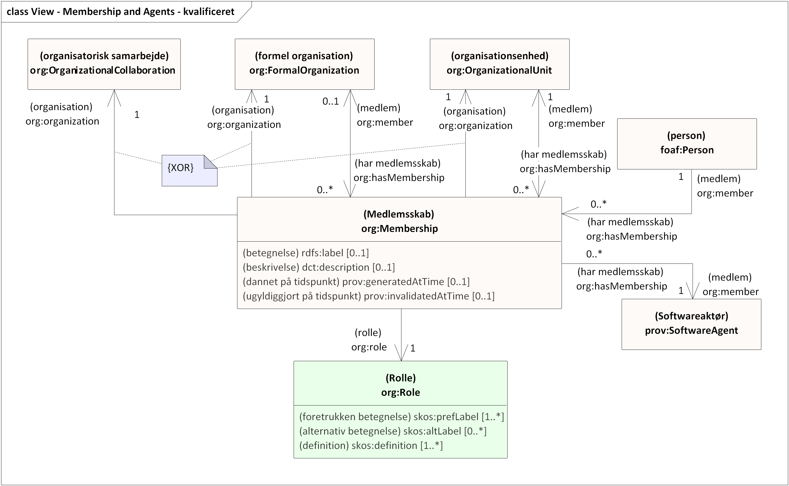
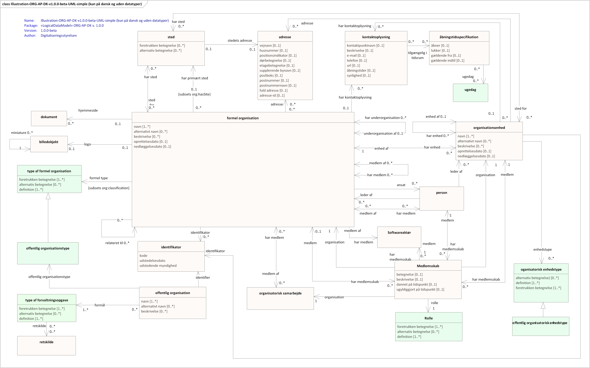
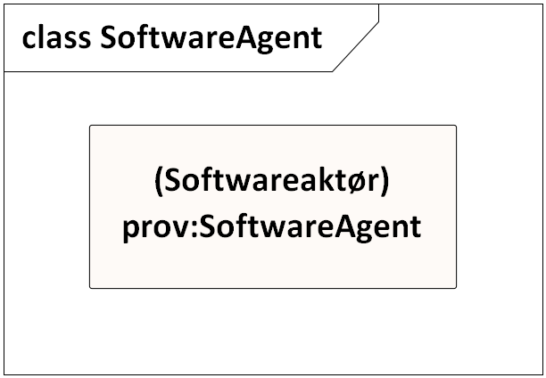

<pre class="metadata">
Title: ORG-AP-DK 1.0.0-beta
Status: LD
URL: https://data.gov.dk/model/profile/ORG-AP-DK/
Editor Term: Udgiver, Udgivere 
Editor: Digitaliseringsstyrelsen,, arkitektur@digst.dk
Abstract: 'ORG-AP-DK 1.0.0-beta' .
Boilerplate: copyright no, conformance no, abstract no
Shortname: ORG-AP-DK
Revision: 1.0.0-beta 
Date: 2021-12-02
Max ToC Depth: 3
Markup Shorthands: markdown yes
Repository: digst/ORG-AP-DK
Translation: en https://digst.github.io/ORG-AP-DK/docs/index-en.html
Inline Github Issues: full
Logo: digst...
</pre>

<h1>UDKAST TIL ORG-AP-DK 1.0.0-beta: Anvendelseprofil for organisation </h1>

#  Introduktion
Dette dokument introducerer modellering af organisationer og definerer en anvendelsesprofil baseret på internationale standarder. Anvendelsesprofilen udgør en fælles model for offentlige såvel som ikke-offentlige organisationer i en dansk administrativ og fællesoffentlig kontekst.

## Formål
Data om organisationer, private eller offentlige, er de helt grundlæggende oplysninger om organisationers navn, struktur, placering, opgaver, mv. Disse data indgår i mange forskellige sammenhænge i offentlige løsninger. Ved at etablere en fælles standard for opbygning og udstilling af data om både private og offentlige organisationer opnås ikke blot et fælles sprog og en fælles struktur, men grundstenene sættes også for større deling og genbrug af data om organisationer.

## Baggrund
Anvendelsesprofilen ORG-AP-DK udarbejdes i tæt koordiering og samarbejde med KL og en referencegruppe bestående af deltagere fra kommuner, regioner og statslige myndigheder som udarbejder en beskrivelse af de forretningsmæssige behov samt bagvedliggende informationsmodel.

Anvendelsesprofilen baseres på internationale standarder. Særligt bidrager de internationale vokabularer [The Organization Ontology (ORG)](https://www.w3.org/TR/vocab-org/) og [Core Public Organisation Vocabulary (CPOV)](https://joinup.ec.europa.eu/release/core-public-organisation-vocabulary-v100) med centrale klasser og egenskaber. ORG-AP-DK er en nærmere specifikation af, hvordan de internationale modeller skal forstås og anvendes – i denne sammenhæng til modellering af data vedrørende organisationer og myndigheder i dansk fællesoffentlig kontekst. 

## Metode
Anvendelsesprofilen er oprettet i henhold de [Fællesoffentlige regler for begrebs- og datamodellering](https://arkitektur.digst.dk/metoder/regler-begrebs-og-datamodellering), og sammensætter således eksisterende vokabularer til en bestemt anvendelse. Teknologisk udspringer de anvendte og foreslåede modeller af Semantic Web/Linked Dataverdenens modelleringsgrundlag, Resource Description Framework (RDF). En basal forståelse af RDF samt kendskab til de her profilerede vokabularer er et godt udgangspunkt for arbejdet med anvendelsesprofilen. ORG og CPOV foreligger i danske oversættelser. Disse oversatte dokumenter udgør normative referencer for den i efterfølgende opstillede anvendelsesprofil.

## Profilens anvendelse

Indsæt reference til KLs brugsscenarier.
Brugsscenarierne er inddelt i en række perspektiver som beskrives nærmere i næste afsnit.

	

# Grundlæggende perspektiver

Det aktuelle udkast omfatter ikke alle ovenstående perspektiver endnu, men vi arbejder løbende på at opdatere modellen.

## Organisation
- En **organisation** defineres bredt af det grundlæggende vokabular, ORG, som *”[…] en samling mennesker, der er organiseret i et fællesskab eller anden social, kommerciel eller politisk struktur. Gruppen har et vist fælles formål eller eksistensberettigelse, der rækker ud over det sæt af personer, der tilhører den. En organisation kan i sig selv fungere som aktør.”*
- En **formel organisation** beskrives af ORG som *”en organisation, der – især i juridisk forstand – er bredt anerkendt og har tilhørende rettigheder og ansvar. Eksempler kan være et aktieselskab eller en velgørende, statslig eller kirkelig forening”.*
- En **organisationsenhed** beskrives af ORG som *”en organisation som en afdeling eller en supportenhed, der er del af en større organisation og kun har fuld anerkendelse i forbindelse med den organisation. Det gælder især, at enheden ikke i sig selv kan opfattes som en juridisk enhed.”.*
- En **organisatorisk samarbejde** beskrives af ORG som *”et samarbejde mellem to eller flere organisationer såsom et projekt”. Det opfylder kriterierne for at være en organisation, idet samarbejdet har en identitet og et veldefineret formål ufhængigt af dets medlemmer, men det det anses hverken formelt som en juridisk enhed eller en underordnet enhed i en større organisation.*
- En **offentlig organisation** beskrives af CPOV som *”enhver organisation, der er defineret som værende en del af den offentlige sektor under en juridisk ramme på ethvert niveau”.*

## Basisinformation
- En organisation og en organisationsenhed kan have et eller flere navne. Et af navnene på et givet sprog vil være det **foretrukne navn**, men andre kan angives som **alternative eller skjulte navne**.
- En organisation og en organisationsenhed kan forsynes med en **tekstbaseret beskrivelse**.
- En organisation og en organisationsenhed kan forsynes med en **identifikator** - Til identifikation af en dansk offentlig organisation kan en myndighedskode anvendes. Kommunekoder og regionskoder udgør begge delmængder af myndighedskoder. Juridiske enheder kan identificeres med brug af et CVR-nummer. 
- En organisation kan have en billedlig repræsentation i form at et **logo** og en **miniature**.
- En organisation kan kædes sammen med dens **hjemmeside** på internettet.

Svarer på følgende brugsscenarier beskrevet af KL: *"3.5 Basisinformation om organisationen"* 

[Se eksempel her](https://digst.github.io/ORG-AP-DK/releases/v.1.0/docs/#eksempel-p-basisinformation)

	
## Organisatorisk struktur
- En organisation kan bestå af flere **underorganisationer** der hver for sig har en specifik identitet, fx kan et ministerium bestå af flere underordnede styrelser.
- En organisation kan være inddelt i mindre **organisationsenheder** hvis eksistens er afhængig af organisationen, fx en afdeling i en større organisation. Organisationer består typisk af mange afdelinger, kontorer, enheder, teams, grupper osv. En organisationsenhed kan også have underordnede enheder.
- Organisationer kan indbyrdes have **andre former for relationer** end de der udtrykkes i form af under- og overorganisatoriske forhold, fx finansiering eller kæderelationer.
- En organisation kan klassificeres som værende af en bestemt **organisationstype**. I forhold til offentlige organisationer kunne det fx være kommune, region, ministerier, styrelser og mange af de andre former for offentlige organisationer, der er en væsentlig del af hverdagen i det offentlige organisationslandskab. 

Svarer på følgende brugsscenarier beskrevet af KL: *"3.1 Hvordan er organisationen bygget op?"* 

[Se eksempel her](https://digst.github.io/ORG-AP-DK/releases/v.1.0/docs/#eksempel-p-organisatoriske-strukturer)

## Kontaktoplysninger
- En organisation eller en organisationsenhed kan give information om hvordan man kommer i kontakt med organisationen eller organisationsenheden.
- En kontaktoplysning kan fx være et **telefonnummer**, en **e-mailadresse**, en **url**, herunder **Digital Post**, gennem hvilken man kan kontakte organisationen eller en repræsentant for organisationen. 
- En kontaktoplysning kan også indholde information om **åbningstider** - enten på simpel vis eller i en mere kompleks struktur med yderligere begrænsninger. 
- Det kan angives hvorvidt en given kontaktoplysning er **synlig** 

Svarer på følgende brugsscenarier beskrevet af KL: *"3.4 Hvordan kontaktes organisationen?"* 

[Se eksempel her](https://digst.github.io/ORG-AP-DK/releases/v.1.0/docs//#eksempel-p-kontaktinformation)

## Sted
- En organisation og en organisationsenheds **fysiske placering** kan angives. En organisation kan også have flere forskellige fysiske placeringer.
- Den placering hvor den formelle organisation **primært er beliggende** - hjemstedet - kan dog også udpeges specifikt. 
- Placeringen kan fx angives med en **adresse** - gerne i henhold til Danmarks Adresseregister (DAR)
- Det kan angives hvilket **administrativt geografisk område** en offentlig organisation dækker forvaltningsmæssigt.

	
## Medlemsskab og aktører
- En persons relation til en organisation og en organisationsenhed kan beskrives som en direkte **medlemskabsrelation**. 
- En organisations relation til en anden organisation kan også have karakter af et **medlemskab**, som giver mulighed for en mere præcis og detaljeret beskrivelse af en medlemsskabsrelation. En person ansat i en organisation kan betragtes som **medlem** af organisationen. I forhold til et givet medlemskab spiller aktøren i forhold til organisationen en **rolle**, som kan specificeres i en klassifikation over **rolletyper**.
- Relationen mellem en organisation eller organisationsenhed til en person, såsom **ansat** og **leder** kan også angives direkte.
- En **softwareaktør**, såsom en softwarerobot (RPA), kan også fungere som en medlem af en organisation og varetage en bestemt rolle i den forbindelse

Svarer på følgende brugsscenarier beskrevet af KL: *"3.3 Hvem er medlemmer af organisationen?"* 

Det aktuelle udkast omfatter endnu ikke beskrivelser af jobfunktioner i organisationen. (Jf. brugsscenariet beskrevet af KL: *"3.2 Hvad arbejder organisationen med?"* )

	
## Historik og opgaver
- En organisations eller organisationsenheds  **oprettelsesdato** eller **nedlæggelsedato** kan angives, og dermed kan både overordnede organisatoriske ændringer og interne omstruktureringer rummes af modellen.
- En offentlig organisation kan tilknyttes de **forvaltningsopgaver** den varetager. Til dette formål anvendes en klassifikation over forvaltningsopgaver, fx. FORM eller KLE. En forvaltningsopgave kan kædes sammen med den **lovgivning, den politik eller anden retskilde**, der ligger til grund for forvaltningsopgaven.

Svarer på følgende brugsscenarier beskrevet af KL: *"3.6.4 Forretningshændelser?"* 

# UML-diagrammer

## Fuld visning af UML-Diagram 
Den fulde anvendelsesprofil ORG-AP-DK v.1.0.0-beta visualiseret med UML-diagram. 

## Forenklet visning af UML-diagram
Forenklet visning af ORG-AP-DK v.1.0.0-beta uden datatyper og stereotyper og kun på dansk)  

# Navneområder
<table class="term-table">
<thead><tr><th>præfiks</th><th>navneområde</th><th>titel</th></tr></thead><tbody>
 <tr><td>org-ap-dk </td><td>https://data.gov.dk/model/profile/organisation/</td><td>Anvendelsesprofil for organisation</td></tr>	
 <tr><td>org </td><td>http://www.w3.org/ns/org# </td><td>Organization Ontology </td></tr>
 <tr><td>cv</td><td>http://data.europa.eu/m8g/ </td><td>e-Government Core Vocabulary </td></tr>
 <tr><td>foaf </td><td>http://xmlns.com/foaf/0.1/ </td><td>Friend of a Friend </td></tr>
 <tr><td>skos </td><td>http://www.w3.org/2004/02/skos/core# </td><td>Simple Knowledge Organization System </td></tr>
 <tr><td>dct </td><td>http://purl.org/dc/terms/ </td><td>Dublin Core Metadata Terms </td></tr>
 <tr><td>prov </td><td>http://www.w3.org/ns/prov# </td><td>The PROV Ontology </td></tr>
 <tr><td>locn </td><td>http://www.w3.org/ns/locn#   </td><td>Location Core Vocabulary </td></tr>
 <tr><td>cpsv </td><td>http://data.europa.eu/cv/ </td><td>Core Public Service Vocabulary </td></tr>
 <tr><td>eli </td><td>http://data.europa.eu/eli/ontology# </td><td>European Legislation Identifier </td></tr>
 <tr><td>schema </td><td>http://schema.org/ </td><td>Schema.org </td></tr>
 <tr><td>rdf </td><td>http://www.w3.org/1999/02/22-rdf-syntax-ns# </td><td>Resource Description Framework </td></tr>
 <tr><td>rdfs </td><td>http://www.w3.org/2000/01/rdf-schema# </td><td>RDF Schema </td></tr>
 <tr><td>owl </td><td>http://www.w3.org/2002/07/owl# </td><td>Web Ontology Language </td></tr>
 <tr><td>xsd </td><td>http://www.w3.org/2001/XMLSchema#  </td><td>XML Schema </td></tr>
 <tr><td>dagi </td><td>https://data.gov.dk/model/profile/cvr# </td><td>Grunddatamodel for Det Centrale Virksomhedsregister </td></tr>
 <tr><td>dar </td><td>https://data.gov.dk/model/profile/dar# </td><td>Grunddatamodel for Danmarks Adresser  </td></tr>
 <tr><td>cvr </td><td>https://data.gov.dk/model/profile/dagi# </td><td>Grunddatamodel for Danmarks Administrative Geografiske Inddeling</td></tr>
 <tr><td>ovx </td><td>https://data.gov.dk/model/organization/extension# </td><td>Organization Vocabulary Extension </td></tr>
</tbody></table>

</table>

# Globalt unikke og stabile identifikatorer	    
Formelle organisationer og organisationsenheder skal identificeres med en unik, stabil og tværgående identifikator der er uafhængig af det system den er skabt i. Derved kan organisationsdata opmærket med organisationsstandarden identificeres unikt på tværs af it-løsninger og organisatoriske skel. 
	    
Der er et generelt behov for at kunne sammenstille organisationsdata fra forskellige kilder og forretningsdata opmærket med organisationsdata på en sikker og nem måde. Det betyder, at der er behov for at de relevante organisationer og enheder er opmærket med en unik, tværgående identifikator. 
	    
Den tværgående identifikator ændres ikke i hele entitetens livstid. Oprettes en f.eks en ny organisationsenhed som erstatning for en tidligere enhed med samme navn, gives den nye en ny unik identifikator. Identifikatoren kan altid efter tildeling anvendes til at finde entiteten. 

Til dette anvendes en eksisterende global og bredt anvendt syntaks - URIer (Uniform Resource Identifiers). URI-specifikationen definerer en fælles syntaks for identificering og adressering af ressourcer som på internettet. Læs mere om unikke og stabile identifikatorer i [RFC 4646](https://www.ietf.org/rfc/rfc3986.txt) [FAIR-principperne](https://www.go-fair.org/fair-principles/), [EU 10 Rules for Persistent URIs](https://joinup.ec.europa.eu/collection/semantic-interoperability-community-semic/document/10-rules-persistent-uris) samt [Retningslinjer for stabile http-urier](https://arkitektur.digst.dk/node/588).

Udover den globalt unikke URI, forsynes organisationer også ofte med andre identifikatorer som udstedes til forskellige formål af specifikke myndigheder, fx. myndighedskoder og CVR-nummer som denne specifikation også kan rumme. 

#  Elementer i ORG-AP-DK
I det følgende præsenteres alle egenskaberne i ORG-AP-DK per klasse.

## Formel organisation

<dl class="def">
<dt>URI</dt>
<dd><a href="http://www.w3.org/ns/org#FormalOrganization" title="URI til FormalOrganization ">http://www.w3.org/ns/org#FormalOrganization </a></dd>
<dt>Foretrukken term </dt>
<dd>formel organisation</dd>	
<dt>Alternativ term </dt>
<dd>organisation</dd>		
<dt>Anvendelsesnote </dt>
<dd>Bruges til at beskrive organisationer der er formelt anerkendt i samfundet med tilhørende rettigheder og ansvar </dd>
<dt>Definition  </dt>
<dd>En organisation der er bredt anerkendt – især i juridisk forstand – og har tilhørende rettigheder og ansvar. </dt>
<dt>Eksempel</dt>
<dd>Eksempler kan være et aktieselskab, en velgørende forening, en statslig administrativ enhed og en kirkelig organisation</dd>
<dt>Specialisering af</dt>
<dd><a href="http://www.w3.org/ns/org#Organization" title="URI for org:Organization">http://www.w3.org/ns/org#Organization</a></dd>
</dl>	 

Klassens egenskaber:	

### navn

<dl class="def">
<dt>URI</dt>
<dd><a href="http://www.w3.org/2004/02/skos/core#prefLabel" title="URI til prefLabel">http://www.w3.org/2004/02/skos/core#prefLabel</a></dd>
<dt>Foretrukken term </dt>
<dd>navn</dd>	
<dt>Anvendelsesnote </dt>
<dd>Bruges til at angive organisationens primære - ofte juridisk anerkendte - navn. Det antages at organisationer kun har et sådant navn på hvert sprog. Primære navne kan angives på flere sprog med flere forekomster af egenskaben skos:prefLabel. </dd>
<dt>Definition  </dt>
<dd>Den foretrukne leksikalske betegnelse for en ressource på et givet sprog. </dt>
<dt>Defineret af</dt>  
<dd><a href="http://www.w3.org/2004/02/skos/core#" title="URI til SKOS">http://www.w3.org/2004/02/skos/core#</a></dd>  
<dt>Udfaldsrum</dt>
<dd><a href="http://www.w3.org/1999/02/22-rdf-syntax-ns#PlainLiteral" title="URI til PlainLiteral">http://www.w3.org/1999/02/22-rdf-syntax-ns#PlainLiteral</a></dd>
<dt>Underegenskab af</dt>
<dd><a href="http://www.w3.org/2000/01/rdf-schema#label" title="URI til label">http://www.w3.org/2000/01/rdf-schema#label</a></dd>

</dl>

### alternativt navn

<dl class="def"><dt>URI</dt>  
<dd><a href="http://www.w3.org/2004/02/skos/core#altLabel" title="URI til altLabel">http://www.w3.org/2004/02/skos/core#altLabel</a></dd>  
<dt>Foretrukken term</dt>  
<dd>alternativt navn</dd>  
<dt>Alternativ term</dt>  
<dd>alternativ betegnelse</dd>  	
<dt>Anvendelsesnote </dt>
<dd>Bruges til at angive et accepteret - men ikke foretrukkent - navn for organisationen</dd>	
<dt>Definition</dt>  
<dd>en alternativ leksikalsk betegnelse for en ressource</dd>  
<dt>Defineret af</dt>  
<dd><a href="http://www.w3.org/2004/02/skos/core#" title="URI til SKOS">http://www.w3.org/2004/02/skos/core#</a></dd>  
<dt>Udfaldsrum:</dt>
<dd><a href="https://www.w3.org/1999/02/22-rdf-syntax-ns#langString" title="URI til langString">https://www.w3.org/1999/02/22-rdf-syntax-ns#langString</a></dd>
<dt>Multiplicitet</dt>
<dd>[0..*]</dd>
</dl>

### beskrivelse 
<dl class="def"><dt>URI</dt>  
<dd><a href="http://purl.org/dc/elements/1.1/description" title="URI til description">http://purl.org/dc/elements/1.1/description</a></dd>  
<dt>Foretrukken term</dt>  
<dd>beskrivelse</dd>  
<dt>Anvendelsesnote </dt>
<dd>Bruges til at angive en tekstbaseret beskrivelse af organisationens formål og arbejde</dd>	
<dt>Definition</dt>  
<dd>en forklaring af en ressource</dd>  
<dt>Defineret af</dt>  
<dd><a href="http://purl.org/dc/elements/1.1/" title="URI til Dublin Core">http://purl.org/dc/elements/1.1/</a></dd>  
<dt>Udfaldsrum:</dt>
<dd><a href="https://www.w3.org/1999/02/22-rdf-syntax-ns#langString" title="URI til langString">https://www.w3.org/1999/02/22-rdf-syntax-ns#langString</a></dd>
<dt>Multiplicitet</dt>
<dd>[0..*]</dd>
</dl>

### oprettelsesdato
<dl class="def"><dt>URI</dt>  
<dd><a href="http://schema.org/foundingDate" title="URI til foundingDate">http://schema.org/foundingDate</a></dd>  
<dt>Foretrukken term</dt>  
<dd>oprettelsesdato</dd>  
<dt>Alternativ betegnelse</dt>
<dd>grundlæggelsesdato</dd>		
<dt>Anvendelsesnote </dt>
<dd>Bruges til at angive den dato hvorpå organisationen blev oprettet</dd>	
<dt>Definition</dt>  
<dd>den dato organisationen blev oprettet</dd>  
<dt>Defineret af</dt>  
<dd>http://schema.org/</dd>  
<dt>Udfaldsrum:</dt>
<dd><a href="http://www.w3.org/2001/XMLSchema#date" title="URI til xsd:date">http://www.w3.org/2001/XMLSchema#date</a></dd>
<dt>Multiplicitet</dt>
<dd>[0..1]</dd>
</dl>

### nedlæggelsesdato
<dl class="def"><dt>URI</dt>  
<dd><a href="http://schema.org/dissolutionDate" title="URI til dissolutionDate">http://schema.org/dissolutionDate</a> </dd>  
<dt>Foretrukken term</dt>  
<dd>nedlæggelsesdato</dd>	
<dt>Alternativ betegnelse)</dt>	
<dd>opløsningsdato</dd>  
<dt>Anvendelsesnote </dt>
<dd>Bruges til at angive den dato hvorpå organisationen blev nedlagt</dd>	
<dt>Definition</dt>  
<dd>den dato organisationen blev nedlagt</dd>  
<dt>Defineret af</dt>  
<dd><a href="http://schema.org/" title="URI til SCHEMA.ORG">http://schema.org/</a></dd>  
<dt>Udfaldsrum:</dt>
<dd><a href="http://www.w3.org/2001/XMLSchema#date" title="URI til xsd:date">http://www.w3.org/2001/XMLSchema#date</a></dd>
<dt>Multiplicitet</dt>
<dd>[0..1]</dd>
</dl>

### identifikator

<dl class="def"><dt>URI</dt>  
<dd><a href="http://www.w3.org/ns/adms#identifier" title="URI til identifier">http://www.w3.org/ns/adms#identifier</a>http://www.w3.org/ns/adms#identifier</dd>  
<dt>Foretrukken term</dt>  
<dd>identifikator</dd>  
<dt>Anvendelsesnote </dt>
<dd>Bruges til at knytte en organisation til en identifikator. Bemærk at en organisation kan have flere identifikatorer tildelt organisationen af forskellige udstedende myndigheder til forskellige formål.</dd>
<dt>Definition</dt>  
<dd>Knytter en ressource til en ADMS identifikator</dt>
<dt>Defineret af</dt>  
<dd><a href="http://www.w3.org/ns/adms#" title="URI til ADMS">http://www.w3.org/ns/adms#</a></dd>  
<dt>Udfaldsrum:</dt>
<dd><a href="http://www.w3.org/ns/adms#Identifier" title="URI til Identifier">http://www.w3.org/ns/adms#Identifier</a></dd>
<dt>Multiplicitet</dt><dd>[0..*]</dd>  
</dl> 

Læs også afsnittet <a href="https://digst.github.io/ORG-AP-DK/releases/v.1.0/docs/#globalt-unikke-og-stabile-identifikatorer" title="Globalt Unikke og stabile Identifikatorer">Globalt Unikke og stabile Identifikatorer</a>

### er underorganisation af 
<dl class="def"><dt>URI</dt>  
<dd><a href="http://www.w3.org/ns/org#subOrganizationOf" title="URI til subOrganizationOf">http://www.w3.org/ns/org#subOrganizationOf</a></dd>  
<dt>Foretrukken term</dt>  
<dd>er underorganisation af</dd>  
<dt>Anvendelsesnote </dt>
<dd>Bruges til at angive en hierarkisk overordnet organisation. </dt>	
<dt>Definition</dt>  
<dd>Repræsenterer hierarkisk indhold af organisationer eller organisatoriske enheder. Den angiver en organisation, som omfatter denne organisation. </dd>  
<dt>Defineret af</dt>  
<dd><a href="http://www.w3.org/ns/org#" title="URI til The Organization Ontology">http://www.w3.org/ns/org#</a></dd>  
<dt>Udfaldsrum:</dt>
<dd><a href="http://www.w3.org/ns/org#FormalOrganization" title="URI til FormalOrganization">http://www.w3.org/ns/org#FormalOrganization</a></dd>
<dt>Multiplicitet</dt><dd>[0..1]</dd>  
</dl>  

### har underorganisation 
<dl class="def"><dt>URI</dt>  
<dd><a href="http://www.w3.org/ns/org#hasSubOrganization" title="URI til hasSubOrganization">http://www.w3.org/ns/org#hasSubOrganization</a></dd>  
<dt>Foretrukken term</dt>  
<dd>har underorganisation</dd>  
<dt>Anvendelsesnote </dt>
<dd>Bruges til at angive en hierarkisk underordnet organisation.</dd>	
<dt>Definition</dt>  
<dd>Repræsenterer hierarkisk indhold af organisationer eller organisatoriske enheder. Egenskaben angiver en organisation, som er en del af denne organisation. </dd>  
<dt>Defineret af</dt>  
<dd><a href="http://www.w3.org/ns/org#" title="URI til The Organization Ontology">http://www.w3.org/ns/org#</a></dd> 
<dt>Udfaldsrum:</dt>
<dd><a href="http://www.w3.org/ns/org#FormalOrganization" title="URI til FormalOrganization">http://www.w3.org/ns/org#FormalOrganization</a></dd>
<dt>Multiplicitet</dt><dd>[0..*]</dd>  
</dl>  

### har enhed 
<dl class="def"><dt>URI</dt>  
<dd><a href="http://www.w3.org/ns/org#hasUnit" title="URI til hasUnit ">http://www.w3.org/ns/org#hasUnit </a></dd>  
<dt>Foretrukken term</dt>  
<dd>har enhed</dd>  
<dt>Anvendelsesnote </dt>
<dd>Bruges til at angive en enhed som er en organisatorisk del af en større organisation. Bemærk at denne organisationsenhed eksistens er afhængig af den organisation den er en del af.</dd>
<dt>Definition</dt>  
<dd>Angiver en enhed, som er del af denne organisation, f.eks. en afdeling i en større organisation </dd>  
<dt>Eksempel</dt>  
<dd>Eksempler kan være afdelinger, kontorer, sektioner, centre og lignende.</dd>  
<dt>Defineret af</dt>  
<dd><a href="http://www.w3.org/ns/org#" title="URI til The Organization Ontology">http://www.w3.org/ns/org#</a></dd> 
<dt>Udfaldsrum:</dt>
<dd><a href="http://www.w3.org/ns/org#OrganizationalUnit" title="URI til OrganizationalUnit">http://www.w3.org/ns/org#OrganizationalUnit</a></dd>
<dt>Multiplicitet</dt>
<dd>[0..*]</dd>  
</dl>  

### relateret til  
<dl class="def"><dt>URI</dt>  
<dd><a href="http://www.w3.org/ns/org#linkedTo" title="URI til linkedTo">http://www.w3.org/ns/org#linkedTo</a></dd>  
<dt>Foretrukken term</dt>  
<dd>relateret til</dd>  
<dt>Anvendelsesnote </dt>
<dd>Bruges til at angive en organisation som denne organisation har en eller anden relation til. Det kan eksempelvis være en finanseringsrelation eller en forsyningskæderelation. </dd>
<dt>Definition</dt>  
<dd>Angiver en arbitrær relation mellem to organisationer. Specialiseringer af denne kan f.eks. bruges til at angive finansiering eller kæderelationer.</dd>  
<dt>Defineret af</dt>  
<dd><a href="http://www.w3.org/ns/org#" title="URI til The Organization Ontology">http://www.w3.org/ns/org#</a></dd> 
<dt>Multiplicitet</dt>
<dd>[0..*]</dd>  
<dt>Udfaldsrum</dt>
<dd><a href="http://www.w3.org/ns/org#FormalOrganization" title="URI til FormalOrganization">http://www.w3.org/ns/org#FormalOrganization</a></dd>
</dl>  

### hjemmeside  
<dl class="def"><dt>URI</dt>  
<dd><a href="http://xmlns.com/foaf/0.1/homepage" title="URI til homepage">http://xmlns.com/foaf/0.1/homepage</a></dd> 
<dt>Foretrukken term</dt>  
<dd>hjemmeside</dd>  
<dt>Anvendelsesnote </dt>
<dd>Bruges til at angive en den primære webside i det websted hvor organisationen præsenterer sig selv</dd>	
<dt>Definition</dt>  
<dd>en hjemmeside for noget</dd>  
<dt>Defineret af</dt>  
<dd><a href="http://xmlns.com/foaf/0.1/" title="URI til FOAF">http://xmlns.com/foaf/0.1/</a></dd> 
<dt>Multiplicitet</dt><dd>[0..*]</dd>  
<dt>Udfaldsrum</dt>
<dd><a href="http://xmlns.com/foaf/0.1/Document" title="URI til Document">http://xmlns.com/foaf/0.1/Document</a></dd>
</dl>  

### logo  
<dl class="def"><dt>URI</dt>  
<dd><a href="http://schema.org/logo" title="URI til logo">http://schema.org/logo</a></dd> 
<dt>Foretrukken term</dt>  
<dd>logo</dd>  
<dt>Anvendelsesnote </dt>
<dd>Bruges til at angive organisationens primære logo</dd>
<dt>Definition</dt>  
<dd>et tilknyttet logo</dd> 
<dt>Defineret af</dt>  
<dd><a href="http://schema.org/" title="URI til SCHEMA.ORG">http://schema.org/</a></dd>  
<dt>Multiplicitet</dt><dd>[0..1]</dd>  
<dt>Udfaldsrum</dt>
<dd><a href="http://schema.org/ImageObject" title="URI til ImageObject">http://schema.org/ImageObject</a></dd>
</dl>  
 

### har primært sted  
<dl class="def"><dt>URI</dt>  
<dd><a href="http://www.w3.org/ns/org#hasPrimarySite" title="URI til hasParimarySite ">http://www.w3.org/ns/org#hasPrimarySite</a></dd> 
<dt>Foretrukken term</dt>  
<dd>har primært sted</dd>  
<dt>Anvendelsesnote</dt>  
<dd>Bruges til at angive en organisations primære sted.</dd>  
<dt>Definition</dt>  
<dd>Angiver organisationens primære lokalitet. Det er det sted, hvor organisationen som standard kan kontaktes, og det er ikke nødvendigvis det formelle hovedkvarter. </dd>  
<dt>Defineret af</dt>  
<dd><a href="http://www.w3.org/ns/org#" title="URI til The Organization Ontology">http://www.w3.org/ns/org#</a></dd>   
<dt>Multiplicitet</dt><dd>[0..1]</dd>  
<dt>Udfaldsrum</dt>
<dd><a href="http://www.w3.org/ns/org#Site" title="URI til Site">http://www.w3.org/ns/org#Site</a></dd>
</dl>  

### har sted   
<dl class="def"><dt>URI</dt>  
<dd><a href="http://www.w3.org/ns/org#hasSite" title="URI til hasSite ">http://www.w3.org/ns/org#hasSite</a></dd> 
<dt>Foretrukken term/dt>  
<dd>har sted</dd>  
<dt>Anvendelsesnote</dt>  
<dd>Bruges til at angive en hvor en organisation i nogen grad befinder sig.</dd>    
<dt>Definition</dt>  
<dd>Angiver et sted, hvor organisationen i nogen grad befinder sig, selv om det kun er indirekte (f.eks. et virtuelt kontor eller en professional servicevirksomhed, der fungerer som den registrerede adresse for en virksomhed). </dd>  
<dt>Defineret af</dt>  
<dd><a href="http://www.w3.org/ns/org#" title="URI til The Organization Ontology">http://www.w3.org/ns/org#</a></dd> 
<dt>Multiplicitet</dt><dd>[0..*]</dd>  
<dt>Udfaldsrum</dt>
<dd><a href="http://www.w3.org/ns/org#Site" title="URI til Site">http://www.w3.org/ns/org#Site</a></dd>
</dl>  

### adresse
<dl class="def"><dt>URI</dt>  
<dd><a href="http://www.w3.org/ns/locn#address" title="URI til address">http://www.w3.org/ns/locn#address</a></dd> 
<dt>Foretrukken term</dt>  
<dd>adresse</dd>
<dt>Anvendelsesnote</dt>  
<dd>Bruges til at angive en organisations adresse</dd>     
<dt>Definition</dt>  
<dd>adresserelationen kan knytte enhver ressource til en adresse </dd>   
<dt>Defineret af</dt>  
<dd><a href="http://www.w3.org/ns/locn#" title="URI til Core Location">http://www.w3.org/ns/locn#</a></dd>   
<dt>Multiplicitet</dt><dd>[0..*]</dd>  
<dt>Udfaldsrum</dt>
<dd><a href="http://www.w3.org/ns/locn#Address" title="URI til Address">http://www.w3.org/ns/locn#Address</a></dd>
</dl>  

### har medlem
<dl class="def"><dt>URI</dt>  
<dd><a href="http://www.w3.org/ns/org#hasMember" title="URI til hasMember">http://www.w3.org/ns/org#hasMember</a></dd>  
<dt>Foretrukken term</dt>  
<dd>har medlem</dd>  
<dt>Anvendelsesnote </dt>
<dd>Bruges til at angive en aktør som er medlem af organisationen.</dd>	
<dt>Definition</dt>  
<dd></dd>  
<dt>Defineret af</dt>  
<dd><a href="http://www.w3.org/ns/org#" title="URI til The Organization Ontology">http://www.w3.org/ns/org#</a></dd> 
<dt>Udfaldsrum:</dt>
<dd>
<a href="http://www.w3.org/ns/org#FormalOrganization" title="URI til FormalOrganization">http://www.w3.org/ns/org#FormalOrganization</a>, 
<a href="http://xmlns.com/foaf/0.1/Person" title="URI til Person">http://xmlns.com/foaf/0.1/Person</a> & SoftwareAgent
</dd>
<dt>Multiplicitet</dt><dd>[0..*]</dd>  
</dl>  

###	ansat  
<dl class="def"><dt>URI</dt>  
<dd><a href="http://schema.org/employee" title="URI til employee">http://schema.org/employee</a></dd> 
<dt>Foretrukken term</dt>  
<dd>ansat</dd>    
<dt>Definition</dt>  
<dd>en person som arbejder for denne organisation</dd>  
<dt>Anvendelsesnote</dt>  
<dd>Egenskaben anvendes alene til at angive at den pågældende er ansat. Detaljerede oplysninger om ansættelsesforholdet, eksempelvis lønforhold, ligger udenfor denne anvendelsesprofils formål.</dd>  
<dt>Defineret af</dt>  
<dd>http://schema.org/</dd>  
<dt>Multiplicitet</dt><dd>[0..*]</dd>  
<dt>Udfaldsrum</dt>
<dd><a href="http://xmlns.com/foaf/0.1/Person" title="URI til Person">http://xmlns.com/foaf/0.1/Person</a></dd> 
</dl>  

### har kontaktoplysning

<dl class="def"><dt>URI</dt>  
<dd><a href="http://data.europa.eu/m8g/contactPoint" title="URI til ContactPoint">http://data.europa.eu/m8g/contactPoint</a></dd>
<dt>Foretrukken term</dt>  
<dd>har kontaktpunkt</dd>  
<dt>Anvendelsesnote</dt>  
<dd>Bruges til at angive hvordan man kommer i kontakt med organisationen</dd>  
<dt>Definition</dt>  
<dd></dd>   
<dt>Defineret af</dt>  
<dd><a href="http://data.europa.eu/m8g/" title="URI til eGovernment Core Vocabularies">http://data.europa.eu/m8g/</a></dd>
<dt>Multiplicitet</dt><dd>[0..*]</dd>  
<dt>Udfaldsrum</dt>
<dd><a href="http://data.europa.eu/m8g/ContactPoint" title="URI til ContactPoint">http://data.europa.eu/m8g/ContactPoint</a></dd>
</dl>  

### formel organisationstype
<dl class="def">
<dt>URI</dt>  
<dd>ovx:formalType</dd>  
<dt>Foretrukken term</dt>  
<dd>formel organisationsstype</dd>  
<dt>Anvendelsesnote</dt>  
<dd>Bruges til at kæde en formel organisation sammen med et SKOS-begreb tilknyttet klassen ovx:FormalOrganizationType.</dd>   
<dt>Definition</dt>  
<dd></dd>   
<dt>Defineret af</dt>  
<dd></dd>  
<dt>Multiplicitet</dt><dd></dd>  
<dt>Udfaldsrum</dt>
<dd>ovx:FormalOrganizationType</dd>
</dl> 

## Organisationsenhed

<dl class="def">  
<dt>URI</dt>  
<dd><a href="http://www.w3.org/ns/org#OrganizationalUnit" title="URI til OrganizationalUnit">http://www.w3.org/ns/org#OrganizationalUnit</a></dd>  
<dt>Foretrukken term</dt>  
<dd>organisationsenhed</dd> 
<dt>Alternativ betegnelse</dt>	
<dd>organisatorisk enhed</dd> 
<dt>Anvendelsesnote </dt>
<dd>Bruges til at beskrive en enhed som er del af en større organisation og som kun har en fuld anerkendelse i forbindelse med den organisation. Organisationer består typisk af mange organisationsenheder som såsom afdelinger, kontorer, enheder, teams, grupper osv. </dd>	 	
<dt>Definition</dt>  
<dd>En organisation som en afdeling eller en supportenhed, der er del af en større organisation og kun har fuld anerkendelse i forbindelse med den organisation. Det gælder især, at enheden ikke i sig selv kan opfattes som en juridisk enhed. </dd>  
<dt>Eksempel </dt>
<dd>Eksempler kan være afdelinger, kontorer, centre, enheder, teams	</dd>
<dt>Defineret af</dt>  
<dd><a href="http://www.w3.org/ns/org#" title="URI til Organization Ontology">http://www.w3.org/ns/org#</a></dd>  
<dt>Specialisering af </dt>
<dd><a href="http://www.w3.org/ns/org#Organization" title="URI til Organization ">http://www.w3.org/ns/org#Organization </a></dd>

</dl>  

### navn

<dl class="def">
<dt>URI</dt>
<dd><a href="http://www.w3.org/2004/02/skos/core#prefLabel" title="URI til prefLabel">http://www.w3.org/2004/02/skos/core#prefLabel</a></dd>
<dt>Foretrukken betegnelse </dt>
<dd>navn</dd>	
<dt>Alternativ betegnelse </dt>
<dd>foretrukken betegnelse</dd>	
<dt>Anvendelsesnote </dt>
<dd>Bruges til at angive organisationsenhedens primære navn. Det antages at organisationsenheder kun har et sådant navn på hvert sprog. Primære navne kan angives på flere sprog med flere forekomster af egenskaben skos:prefLabel. </dd>
<dt>Definition </dt>
<dd>Den foretrukne leksikalske betegnelse for en ressource på et givet sprog. </dt>
<dt>Udfaldsrum</dt>
<dd><a href="http://www.w3.org/1999/02/22-rdf-syntax-ns#PlainLiteral" title="URI til PlainLiteral">http://www.w3.org/1999/02/22-rdf-syntax-ns#PlainLiteral</a></dd>
<dt>Underegenskab af</dt>
<dd><a href="http://www.w3.org/2000/01/rdf-schema#label" title="URI til label">http://www.w3.org/2000/01/rdf-schema#label </a></dd>
</dl>

### alternativt navn

<dl class="def"><dt>URI</dt>  
<dd><a href="http://www.w3.org/2004/02/skos/core#altLabel" title="URI til altLabel">http://www.w3.org/2004/02/skos/core#altLabel</a></dd>  
<dt>Foretrukken term</dt>  
<dd>alternativt navn</dd>  
<dt>Alternativ term</dt>  
<dd>alternativ betegnelse</dd>  	
<dt>Anvendelsesnote </dt>
<dd>Bruges til at angive et accepteret - men ikke foretrukkent - navn for organisationsenheden</dt>	
<dt>Definition</dt>  
<dd>en alternativ leksikalsk betegnelse for en ressource</dd>  
<dt>Defineret af</dt>  
<dd><a href="http://www.w3.org/2004/02/skos/core#" title="URI til SKOS">http://www.w3.org/2004/02/skos/core#</a></dd>  
<dt>Udfaldsrum:</dt>
<dd><a href="http://www.w3.org/1999/02/22-rdf-syntax-ns#langString" title="URI til langString">http://www.w3.org/1999/02/22-rdf-syntax-ns#langString</a></dd>
<dt>Multiplicitet</dt>
<dd>[0..*]</dd>
</dl>

### beskrivelse 
<dl class="def">
<dt>URI</dt>  
<dd><a href="http://purl.org/dc/elements/1.1/description" title="URI til description">http://purl.org/dc/elements/1.1/description</a></dd>   
<dt>Foretrukken term</dt>  
<dd>beskrivelse</dd>  
<dt>Anvendelsesnote </dt>
<dd>Bruges til at angive en tekstbaseret beskrivelse af organisationsenhedens formål og arbejde</dd>
<dt>Definition</dt>  
<dd>en forklaring af en ressource</dd>  
<dt>Defineret af</dt>  
<dd><a href="http://purl.org/dc/elements/1.1/" title="URI til Dublin Core">http://purl.org/dc/elements/1.1/</a></dd>  
<dt>Udfaldsrum:</dt>
<dd><a href="http://www.w3.org/1999/02/22-rdf-syntax-ns#langString" title="URI til langString">http://www.w3.org/1999/02/22-rdf-syntax-ns#langString</a></dd>
<dt>Multiplicitet</dt>
<dd>[0..*]</dd>
</dl>

### oprettelsesdato
<dl class="def"><dt>URI</dt>  
<dd><a href="http://schema.org/foundingDate" title="URI til foundingDate">http://schema.org/foundingDate</a></dd>  
<dt>Foretrukken term</dt>  
<dd>oprettelsesdato</dd>  
<dt>Alternativ betegnelse </dt>
<dd>grundlæggelsesdato</dd>		
<dt>Anvendelsesnote </dt>
<dd>Bruges til at angive den dato hvorpå organisationsenheden blev oprettet</dd>	
<dt>Definition</dt>  
<dd>den dato organisationen blev oprettet</dd>  
<dt>Defineret af</dt>  
<dd><a href="http://schema.org/" title="URI til SCHEMA.ORG">http://schema.org/</a></dd>   
<dt>Udfaldsrum:</dt>
<dd><a href="http://www.w3.org/2001/XMLSchema#date" title="URI til xsd:date">http://www.w3.org/2001/XMLSchema#date</a></dd>
<dt>Multiplicitet</dt>
<dd>[0..1]</dd>
</dl>

### nedlæggelsesdato
<dl class="def"><dt>URI</dt>  
<dd><a href="http://schema.org/dissolutionDate" title="URI til dissolutionDate">http://schema.org/dissolutionDate</a> </dd>  
<dt>Foretrukken term</dt>  
<dd>nedlæggelsesdato</dd>	
<dt>Alternativ betegnelse)</dt>	
<dd>opløsningsdato</dd>  
<dt>Anvendelsesnote </dt>
<dd>Bruges til at angive den dato hvorpå organisationsenheden blev nedlagt</dd>	
<dt>Definition</dt>  
<dd>den dato organisationen blev nedlagt</dd>  
<dt>Defineret af</dt>  
<dd><a href="http://schema.org/" title="URI til SCHEMA.ORG">http://schema.org/</a></dd>   
<dt>Udfaldsrum:</dt>
<dd><a href="http://www.w3.org/2001/XMLSchema#date" title="URI til xsd:date">http://www.w3.org/2001/XMLSchema#date</a></dd>
<dt>Multiplicitet</dt>
<dd>[0..1]</dd>
</dl>

### er enhed af
<dl class="def"><dt>URI</dt>  
<dd><a href="http://www.w3.org/ns/org#unitOf" title="URI til unitOf ">http://www.w3.org/ns/org#unitOf </a></dd>  
<dt>Foretrukken term</dt>  
<dd>enhed af</dd>  
<dt>Anvendelsesnote</dt>  
<dd>Bruges til at angive en organisation eller en organisationsenhed, som denne enhed er en del af </dd>  
<dt>Definition </dt>
<dd>Angiver en organisation som denne organisationsenhed er en del af.</dd>	
<dt>Defineret af</dt>  
<dd><a href="http://www.w3.org/ns/org#" title="URI til Organization Ontology">http://www.w3.org/ns/org#</a></dd>  
<dt>Multiplicitet</dt><dd>[0..1]</dd>  
<dt>Udfaldsrum</dt>
<dd>
<a href="http://www.w3.org/ns/org#FormalOrganization" title="URI til FormalOrganization">http://www.w3.org/ns/org#FormalOrganization</a> & 
<a href="http://www.w3.org/ns/org#OrganizationalUnit" title="URI til OrganizationalUnit">http://www.w3.org/ns/org#OrganizationalUnit</a>
</dd>
</dl>  

### har enhed 
<dl class="def"><dt>URI</dt>  
<dd><a href="http://www.w3.org/ns/org#hasUnit" title="URI til hasUnit ">http://www.w3.org/ns/org#hasUnit </a></dd>  
<dt>Foretrukken term</dt>  
<dd>har enhed</dd>  
<dt>Anvendelsesnote </dt>
<dd>Bruges til at angive en organisationsenhed som er en del af denne organisationsenhed</dd>	
<dt>Definition </dt>
<dd>Angiver en enhed som er den del af denne organisation</dd>		
<dt>Defineret af</dt>  
<dd><a href="http://www.w3.org/ns/org#" title="URI til Organization Ontology">http://www.w3.org/ns/org#</a></dd>  
<dt>Udfaldsrum:</dt>
<dd><a href="http://www.w3.org/ns/org#OrganizationalUnit" title="URI til OrganizationalUnit">http://www.w3.org/ns/org#OrganizationalUnit</a></dd>
<dt>Multiplicitet</dt>
<dd>[0..*]</dd>  
</dl>  

### har sted
<dl class="def"><dt>URI</dt>  
<dd><a href="http://www.w3.org/ns/org#hasSite" title="URI til hasSite ">http://www.w3.org/ns/org#hasSite</a></dd> 
<dt>Foretrukken term/dt>  
<dd>har sted</dd>
<dt>Anvendelsesnote</dt>  
<dd>Angiver et sted, hvor organisationsenheden i nogen grad befinder sig, selv om det kun er indirekte (f.eks. et virtuelt kontor). </dd>    
<dt>Definition</dt>  
<dd>et sted, hvor organisationen i nogen grad befinder sig, selv om det kun er indirekte (f.eks. et virtuelt kontor).</dd>  
<dt>Defineret af</dt>  
<dd><a href="http://www.w3.org/ns/org#" title="URI til Organization Ontology">http://www.w3.org/ns/org#</a></dd>  
<dt>Multiplicitet</dt><dd>[0..*]</dd>  
<dt>Udfaldsrum</dt>
<dd><a href="http://www.w3.org/ns/org#Site" title="URI til Site">http://www.w3.org/ns/org#Site</a></dd>
</dl>  

### adresse
<dl class="def"><dt>URI</dt>  
<dd><a href="http://www.w3.org/ns/locn#address" title="URI til address">http://www.w3.org/ns/locn#address</a></dd> 
<dt>Foretrukken term</dt>  
<dd>adresse</dd>   
<dt>Anvendelsesnote</dt>  
<dd>Bruges til at angive organisationsenhedens adresse</dd> 
<dt>Definition</dt>  
<dd>adresserelationen kan knytte enhver ressource til en adresse </dd>   
<dt>Defineret af</dt>  
<dd><a href="http://www.w3.org/ns/locn#" title="URI til Core Location">http://www.w3.org/ns/locn#</a></dd>   
<dt>Multiplicitet</dt><dd>[0..*]</dd>  
<dt>Udfaldsrum</dt>
<dd><a href="http://www.w3.org/ns/locn#Address" title="URI til Address">http://www.w3.org/ns/locn#Address</a></dd>
</dl>  

### enhedstype
<dl class="def">
<dt>URI</dt>  
<dd>ovx:unitType</dd>  
<dt>Foretrukken term</dt>  
<dd>enhedstype</dd>  
<dt>Anvendelsesnote</dt>  
<dd>Bruges til kæde en organisationsenhed sammen med et SKOS-begreb tilknyttet klassen ovx:OrganizationalUnitType.</dd> 
<dt>Definition</dt>  
<dd></dd>   
<dt>Defineret af</dt>  
<dd></dd>  
<dt>Multiplicitet</dt><dd>[0..*]</dd>  
<dt>Udfaldsrum</dt>
<dd>ovx:OrganizationalUnitType</dd>
</dl> 

## Organisatorisk samarbejde

<dl class="def">
<dt>URI</dt>
<dd><a href="http://www.w3.org/ns/org#OrganizationalCollaboration" title="URI til OrganizationalCollaboration">http://www.w3.org/ns/org#OrganizationalCollaboration</a></dd> 
<dt>Foretrukken betegnelse </dt>
<dd>organisatorisk samarbejde</dd>		
<dt>Anvendelsesnote </dt>
<dd>Bruges til at beskrivel et samarbejde mellem to eller flere organisationer </dd>
<dt>Definition </dt>
<dd>Et samarbejde mellem to eller flere organisationer såsom et projekt”. Det opfylder kriterierne for at være en organisation, idet samarbejdet har en identitet og et veldefineret formål ufhængigt af dets medlemmer, men det det anses hverken formelt som en juridisk enhed eller en underordnet enhed i et større organisation</dt>
<dt>Specialisering af </dt>
<dd><a href="http://www.w3.org/ns/org#Organization" title="URI til The Organization Ontology">http://www.w3.org/ns/org#Organization </a></dd>
</dl>	 

Klassens egenskaber:	

### har medlem
<dl class="def"><dt>URI</dt>  
<dd><a href="http://www.w3.org/ns/org#hasMember" title="URI til hasMember">http://www.w3.org/ns/org#hasMember</a></dd>  
<dt>Foretrukken term</dt>  
<dd>har medlem</dd>  
<dt>Anvendelsesnote </dt>
<dd>Bruges til at angive en aktør som er medlem af organisationen.</dd>	
<dt>Definition</dt>  
<dd></dd>  
<dt>Defineret af</dt>  
<dd><a href="http://www.w3.org/ns/org#" title="URI til The Organization Ontology">http://www.w3.org/ns/org#</a></dd> 
<dt>Udfaldsrum:</dt>
<dd>
<a href="http://www.w3.org/ns/org#FormalOrganization" title="URI til FormalOrganization">http://www.w3.org/ns/org#FormalOrganization</a>, 
<a href="http://xmlns.com/foaf/0.1/Person" title="URI til Person">http://xmlns.com/foaf/0.1/Person</a> & SoftwareAgent
</dd>
<dt>Multiplicitet</dt><dd>[0..*]</dd>  
</dl>  

## Offentlig organisation

<dl class="def">
<dt>URI</dt>
<dd><a href="http://data.europa.eu/m8g/PublicOrganisation " title="URI til PublicOrganisation">http://data.europa.eu/m8g/PublicOrganisation</a></dd> 
<dt>Foretrukken betegnelse </dt>
<dd>offentlig organisation</dd>		
<dt>Anvendelsesnote </dt>
<dd>Bruges til at beskrive organisationer der defineres som værende en del af den offentlige sektor under en juridsk ramme på ethvert niveau. En organisation kan bestå af flere underorganisationer, og enhver organisation kan have én eller flere organisationsenheder. Hver af disse beskrives med de samme typer af egenskaber og relationer. </dd>
<dt>Definition </dt>
<dd>Enhver organisation der defineres som værende en del af den offentlige sektor under en juridsk ramme på ethvert niveau</dt>
<dt>Specialisering af </dt>
<dd><a href="http://www.w3.org/ns/org#Organization" title="URI til Organization ">http://www.w3.org/ns/org#Organization </a></dd>
</dl>	 
Klassens egenskaber:	

### navn
<dl class="def">
<dt>URI</dt>
<dd><a href="http://www.w3.org/2004/02/skos/core#prefLabel" title="URI til prefLabel">http://www.w3.org/2004/02/skos/core#prefLabel</a></dd>
<dt>Foretrukken term </dt>
<dd>navn</dd>	
<dt>Anvendelsesnote </dt>
<dd>Bruges til at angive den offentlige organisations primære - ofte juridisk anerkendte - navn. Det antages at organisationer kun har et sådant navn på hvert sprog. Primære navne kan angives på flere sprog med flere forekomster af egenskaben skos:prefLabel. </dd>
<dt>Definition  </dt>
<dd>Den foretrukne leksikalske betegnelse for en ressource på et givet sprog. </dt>
<dt>Udfaldsrum</dt>
<dd><a href="http://www.w3.org/1999/02/22-rdf-syntax-ns#PlainLiteral" title="URI til PlainLiteral">http://www.w3.org/1999/02/22-rdf-syntax-ns#PlainLiteral</a></dd>
<dt>Underegenskab af</dt>
<dd><a href="http://www.w3.org/2000/01/rdf-schema#label" title="URI til label">http://www.w3.org/2000/01/rdf-schema#label</a></dd>

</dl>

### alternativt navn
<dl class="def"><dt>URI</dt>  
<dd><a href="http://www.w3.org/2004/02/skos/core#altLabel" title="URI til altLabel">http://www.w3.org/2004/02/skos/core#altLabel</a></dd>  
<dt>Foretrukken term</dt>  
<dd>alternativt navn</dd>  
<dt>Alternativ term</dt>  
<dd>alternativ betegnelse</dd>  	
<dt>Anvendelsesnote </dt>
<dd>Bruges til at angive et accepteret - men ikke foretrukkent - navn for den offentlige organisation</dd>	
<dt>Definition</dt>  
<dd>en alternativ leksikalsk betegnelse for en ressource</dd>  
<dt>Defineret af</dt>  
<dd><a href="http://www.w3.org/2004/02/skos/core#" title="URI til ">http://www.w3.org/2004/02/skos/core#</a></dd>  
<dt>Udfaldsrum:</dt>
<dd><a href="https://www.w3.org/1999/02/22-rdf-syntax-ns#langString" title="URI til langString">https://www.w3.org/1999/02/22-rdf-syntax-ns#langString</a></dd>
<dt>Multiplicitet</dt>
<dd>[0..*]</dd>
</dl>

### beskrivelse 
<dl class="def"><dt>URI</dt>  
<dd><a href="http://purl.org/dc/elements/1.1/description" title="URI til description">http://purl.org/dc/elements/1.1/description</a></dd>  
<dt>Foretrukken term</dt>  
<dd>beskrivelse</dd>  
<dt>Anvendelsesnote </dt>
<dd>Bruges til at angive en tekstbaseret beskrivelse af den offentlige organisations formål og arbejde</dd>	
<dt>Definition</dt>  
<dd>en forklaring af en ressource</dd>  
<dt>Defineret af</dt>  
<dd>http://purl.org/dc/elements/1.1/</dd>  
<dt>Udfaldsrum:</dt>
<dd><a href="https://www.w3.org/1999/02/22-rdf-syntax-ns#langString" title="URI til langString">https://www.w3.org/1999/02/22-rdf-syntax-ns#langString</a></dd>
<dt>Multiplicitet</dt>
<dd>[0..*]</dd>
</dl>

### geografisk dækning
<dl class="def"><dt>URI</dt>  
<dd><a href="http://purl.org/dc/elements/1.1/spatial" title="URI til spatial">http://purl.org/dc/elements/1.1/spatial</a></dd>  
<dt>Foretrukken term</dt>  
<dd>geografisk dækning</dd>  
<dt>Anvendelsesnote </dt>
<dd>Bruges til at angive et administrativt geografisk område som en offentlig organisation dækker forvaltningsmæssigt</dd>	
<dt>Definition</dt>  
<dd>ressourcens geografiske dækning</dd>  
<dt>Defineret af</dt>  
<dd>http://purl.org/dc/elements/1.1/</dd>  
<dt>Udfaldsrum:</dt>
<dd><a href="https://www.w3.org/1999/02/22-rdf-syntax-ns#langString" title="URI til langString">https://www.w3.org/1999/02/22-rdf-syntax-ns#langString</a></dd>
<dt>Multiplicitet</dt>
<dd>[0..*]</dd>
</dl>

### formål
<dl class="def"><dt>URI</dt>  
<dd><a href="http://www.w3.org/ns/org#purpose" title="URI til hasUnit ">http://www.w3.org/ns/org#purpose</a></dd>  
<dt>Foretrukken term</dt>  
<dd>formål</dd>  
<dt>Anvendelsesnote </dt>
<dd>Bruges til at referere til klassifikation af offentlige forvaltningsopgaver</dd>	
<dt>Definition </dt>
<dd>Angiver organisationens formål. Der kan være mange formål på forskellige abstraktionsniveauer, men det ligger i en organisations natur at have en grund til at eksistere. Denne egenskab er en metode til at dokumentere denne grund. En organisation kan have flere formål. 
</dd>	
<dt>Kommentar </dt>
<dd>Det anbefales, at formålet bliver angivet af en reguleret term- eller kodeliste, ideelt klassen skos:Concept. Rækkevidden er dog åben for andre typer beskrivende systemer. Det er forventet, at profiler i dette vokabularium vil indsnævre rækkevidden af org:purpose. Alternative navne: emne, ansvar (især hvis det bruges på organisatoriske enheder som statslige departementer.)
</dd>	
<dt>Defineret af</dt>  
<dd><a href="http://www.w3.org/ns/org#" title="URI til Organization Ontology">http://www.w3.org/ns/org#</a></dd>  
<dt>Udfaldsrum:</dt>
<dd><a href=" http://www.w3.org/2004/02/skos/core#Concept" title="URI til skos:Concept"> http://www.w3.org/2004/02/skos/core#Concept</a></dd>
<dt>Multiplicitet</dt>
<dd>[0..*]</dd>  
</dl>  

### offentlig organisationstype
<dl class="def">
<dt>URI</dt>  
<dd></dd>  
<dt>Foretrukken term</dt>  
<dd>offentlig organisationstype</dd>  
<dt>Anvendelsesnote</dt>  
<dd>Bruges til at angive den formelle organisation som den offentlige organisation er medlem af</dd>  
<dt>Definition</dt>  
<dd></dd>   
<dt>Defineret af</dt>  
<dd></dd>  
<dt>Multiplicitet</dt><dd></dd>  
<dt>Udfaldsrum</dt>
<dd>ovx:PublicOrganizationType</dd>
</dl> 

### medlem af
<dl class="def">
<dt>URI</dt>  
<dd><a href="http://www.w3.org/ns/org#memberOf" title="URI til memberOf">http://www.w3.org/ns/org#memberOf</a></dd> 
<dt>Foretrukken term</dt>  
<dd>medlem af</dd>   
<dt>Anvendelsesnote</dt>  
<dd>Bruges til at angive den formelle organisation som den offentlige organisation er medlem af</dd>  
<dt>Definition</dt>  
<dd>Angiver, at en aktør (person eller anden organisation) er medlem af organisationen uden at angive medlemskabets natur eller rolle i den. </dd>  
<dd>Bemærk, at valget af navn på egenskaben ikke er tænkt til at begrænse egenskaber til kun formelle medlemskabsarrangementer. Det er også tiltænkt, at det skal dække relaterede begreber, f.eks. tilhørsforhold eller andet engagement i organisationen. Ekstensioner kan specialisere denne relation til at angive bestemte roller inden for organisationen eller mere nuancerede relationer til organisationen. </dd>  
<dt>Defineret af</dt>  
<dd><a href="http://www.w3.org/ns/org#" title="URI til Organization Ontology">http://www.w3.org/ns/org#</a></dd>  
<dt>Multiplicitet</dt><dd>[0..*]</dd>  
<dd><a href="http://www.w3.org/ns/org#FormalOrganization" title="URI til Formal Organization">http://www.w3.org/ns/org#FormalOrganization</a></dd>  
</dl>

## Kontaktoplysning 

<dl class="def">  
<dt>URI</dt>  
<dd><a href="http://data.europa.eu/m8g/ContactPoint" title="URI til ContactPoint">http://data.europa.eu/m8g/ContactPoint</a></dd>  
<dt>Foretrukken term</dt>  
<dd>kontaktoplysning</dd>  
<dt>Anvendelsesnote</dt>  
<dd>Bruges til at repræsentere en kontaktoplysning for organisationen</dd>  
<dt>Definition</dt>  
<dd>Oplysning om hvordan man kan kontakte organisationen</dd>  

<dt>Defineret af</dt>  
<dd><a href="http://data.europa.eu/m8g/" title="URI til Core Vocabularies">http://data.europa.eu/m8g/</a></dd>  
</dl>  
  
Klassens egenskaber:	

### kontakttype  
<dl class="def"><dt>URI</dt>  
<dd><a href="https://schema.org/contactType<" title="URI til contactType">https://schema.org/contactType</a></dd>  
<dt>Foretrukken term</dt>  
<dd>kontakttype</dd>  
<dt>Anvendelsenote</dt>  
<dd>Bruges til at klassificere kontaktoplysninger</dd>  
<dt>Defineret af</dt>  
<dd><a href="http://schema.org/" title="URI til Schema.org ">http://schema.org/</a></dd>  
<dt>Udfaldsrum</dt>
<dd><a href="http://www.w3.org/1999/02/22-rdf-syntax-ns#langString" title="URI til langString">http://www.w3.org/1999/02/22-rdf-syntax-ns#langString</a></dd>
<dt>Multiplicitet</dt><dd>[0..1]</a></dd>
</dl>

### synlighed  
<dl class="def"><dt>URI</dt>  
<dd></dd>  
<dt>Foretrukken term</dt>  
<dd>synlighed</dd>  
<dt>Anvendelsenote</dt>  
<dd>Bruges til markere hvorvidt kontaktoplysningen må vises offentligt eller ikke</dd>  
<dt>Definition</dt>  
<dd></dd>  
<dt>Udfaldsrum</dt>
<dd></dd>
<dt>Multiplicitet</dt><dd>[0..1]</a></dd>
</dl>

NY! Fra KL: Definition: markerer hvorvidt kontaktinformationen må vises offentligt eller ikke. Kommentar: På eksempelvis hjemmesider, markerer denne hvorvidt oplysningen er ekstern tilgængelig, kun til intern brug eller hemmelig. Eksempel: - eksternt - internt - hemmeligt 

### telefonnummer
<dl class="def"><dt>URI</dt>  
<dd><a href="http://data.europa.eu/m8g/hasTelephone" title="URI til hasTelephone">http://data.europa.eu/m8g/hasTelephone</a></dd>   
<dt>Foretrukken term</dt>  
<dd>telefon</dd>  
<dt>Accepteret term</dt>  
<dd>telefonnummer</dd>  
<dt>Anvendelsesnote</dt>  
<dd>telefonnummer som man man ringe til hvis man vil i kontakt med organisationen eller organisationsenheden </dd> 
<dt>Definition</dt>  
<dd></dd>  
<dt>Defineret af</dt>  
<dd><a href="http://data.europa.eu/m8g/" title="URI til eGovernment Core Vocabularies">http://data.europa.eu/m8g/</a></dd>   
<dt>Udfaldsrum</dt>
<dd><a href="http://www.w3.org/2000/01/rdf-schema#Literal" title="URI til Literal">http://www.w3.org/2000/01/rdf-schema#Literal</a></dd>
<dt>Multiplicitet</dt><dd>[0..1]</a></dd></dl>  

### email 
<dl class="def"><dt>URI</dt>  
<dd><a href="http://data.europa.eu/m8g/hasEmail" title="URI til hasEmail">http://data.europa.eu/m8g/hasEmail</a></dd>   
<dt>Foretrukken term</dt>  
<dd>e-mail</dd>  
<dt>Accepteret term</dt>  
<dd>e-mailadresse</dd>  
<dt>Anvendelsesnote</dt>  
<dd>emailadresse som man han skrive til hvis man vil i kontakt med organisationen eller organisationsenheden</dd>  
<dt>Definition</dt>  
<dd>adresse der identificerer en elektronisk postkasse</dd>  
<dt>Defineret af</dt>  
<dd><a href="http://data.europa.eu/m8g/" title="URI til eGovernment Core Vocabularies">http://data.europa.eu/m8g/</a></dd> 
<dt>Udfaldsrum</dt>
<dd><a href="http://www.w3.org/2000/01/rdf-schema#Literal" title="URI til Literal">http://www.w3.org/2000/01/rdf-schema#Literal</dd>
<dt>Multiplicitet</dt><dd>[0..1]</a></dd>
</dl>

### url 
<dl class="def"><dt>URI</dt>  
<dd></dd>  
<dt>Foretrukken term</dt>  
<dd>url</dd>   
<dt>Definition</dt>  
<dd>adresse til en ressource på internettet</dd>  
<dt>Eksempler</dt>  
<dd>Eksempelvis en organisations webkontaktformular, Facebook- eller LinkedIn-side</dd>  
<dt>Anvendelsesnote</dt>  
<dd>Bruges til at referere til en webside hvorigennem en organisation kan kontaktes. Omfatter organisationers anvendelse af sociale medier.</dd>  
<dt>Defineret af</dt>  
<dd></dd>  
<dt>Udfaldsrum</dt>
<dd></dd>
<dt>Multiplicitet</dt><dd>[0..1]</a></dd>
</dl>
	

I EUs  eGovernment Core Vocabularies oprettes muligvis en ny egenskab til angivelse af kontaktpunkter repræsenteret ved url'er

	
	
### åbningstider
<dl class="def"><dt>URI</dt>  
<dd><a href="http://data.europa.eu/m8g/hasEmail" title="URI til hasEmail">http://data.europa.eu/m8g/hasEmail</a></dd>    
<dt>Foretrukken term</dt>  
<dd>åbningstider</dd>  
<dt>Anvendelsesnote</dt>  
<dd>Bruges til at angive de normale åbningstider for organisationen eller organisationsenheden.</dd>  
<dt>Definition</dt>  
<dd>Angiver den normale åbningstid for organisationen. </dd>  
<dt>Kommentar</dt>  
<dd>Værdien af denne egenskab er struktureret tekst, der angiver det tidsrum, hvor kontaktpunktet normalt er tilgængeligt.
Dage angives med kombinationer af to bogstaver: Mo, Tu, We, Th, Fr, Sa, Su. Flere dage kan angives, adskilt med komma ’,’ mellem de enkelte dage. Dage og timer kan angives som et tidsrum, med brug af bindestreg ’-’.
Hvis kontaktpunktet f.eks. er åbent mandag til fredag fra 9 -17, vil værdien af openingHours være Mo-Fr 09:00-17:00. Hvis kontaktpunktet er tilgængeligt tirsdag og torsdag mellem 16 og 20, vil værdien være Tu,Th 16:00-20:00.
</dd>  
<dt>Defineret af</dt>  
<dd><a href="http://data.europa.eu/m8g/" title="URI til Core Vocabularies">http://data.europa.eu/m8g/</a></dd>  
<dt>Udfaldsrum</dt>
<dd><a href="http://www.w3.org/2000/01/rdf-schema#Literal" title="URI til Literal">http://www.w3.org/2000/01/rdf-schema#Literal</a></dd>
<dt>Multiplicitet</dt>
<dd>[0..1]</a></dd></dl>

### tilgænglig i tidsrum 
<dl class="def"><dt>URI</dt>  
<dd><a href="http://schema.org/hoursAvailable" title="URI til hoursAvailable ">https://schema.org/hoursAvailable </a></dd>  
<dt>Foretrukken term</dt>  
<dd>tilgængelig i tidsrum</dd>  
<dt>Anvendelsesnote</dt>  
<dd>Bruges til at angive i hvilket tidsrum organisationen eller organisationsenheden har åbent</dd>  
<dt>Definition</dt>  
<dd>tidsrum hvor denne service eller dette kontaktpunkt er tilråde</dd>  
<dt>Defineret af</dt>  
<dd><a href="http://schema.org/" title="URI til Schema.org">http://schema.org/</a></dd>  
<dt>Multiplicitet</dt><dd>[0..*]</dd>  
<dt>Udfaldsrum</dt>
<dd><a href="http://schema.org/OpeningHoursSpecification" title="URI til OpeningsHoursSpecification">http://schema.org/OpeningHoursSpecification</a></dd>  
</dl>  
 

Det er endnu uvist om eGovernment Core Vocabularies opretter en ny egenskab for hoursAvailable ækvivalent med egenskaben fra Schema.org

 
<strong>Objektegenskaber (associationsender): </strong>  

## Åbningstidsspecifikation  

<dl class="def">  
<dt>URI</dt>  
<dd><a href="http://schema.org/OpeningHoursSpecification" title="URI til OpeningHoursSpecification ">https://schema.org/OpeningHoursSpecification </a></dd>  
<dt>Foretrukken term</dt>  
<dd>åbningstidsspecifikation</dd>   
<dt>Definition</dt>  
<dd>En struktureret værdi som giver information om åbningstider for en lokation eller en bestemt service der tilbydes på en lokation.
Lokationen er åben hvis egenskaben ”åbner” er specificeret og ellers lukket.
Hvis værdien for egenskaben ”lukker” er mindre end værdien for ”åbner” så antages det at perioden omfatter næste dag.
</dd>  
<dt>Defineret af</dt>  
<dd><a href="http://schema.org/" title="URI til Schema.org">https://schema.org/</a></dd>  
</dl>  
 

Det er endnu uvist om eGovernment Core Vocabularies opretter en ny klasse for OpeningsHoursSpecification ækvivalent med klassen fra Schema.org

 
 
  
Klassens egenskaber:	

### lukker  
<dl class="def"><dt>URI</dt>  
<dd><a href="http://schema.org/closes" title="URI til closes">https://schema.org/closes</a></dd>  
<dt>Foretrukken term</dt>  
<dd>lukker</dd>  
<dt>Definition</dt>  
<dd>det tidspunkt lokationen eller tjenesten lukker på den eller de angive ugedage</dd>  
<dt>Defineret af</dt>  
<dd><a href="http://schema.org/closes" title="URI til closes">https://schema.org/closes</a></dd>  
<dt>Udfaldsrum</dt>
<dd><a href="http://www.w3.org/2001/XMLSchema#time" title="URI til xsd:time">http://www.w3.org/2001/XMLSchema#time</a></dd>
<dt>Multiplicitet</dt><dd>[0..1]</dd>
</dl>

### åbner 
<dl class="def"><dt>URI</dt>  
<dd><a href="http://schema.org/opens" title="URI til opens">https://schema.org/opens</a></dd>  
<dt>Foretrukken term</dt>  
<dd>åbner</dd>  
<dt>Definition</dt>  
<dd>det tidspunkt lokationen eller tjenesten åbner på den eller de angive ugedage</dd>  
<dt>Defineret af</dt>  
<dd><a href="http://schema.org/" title="URI til Schema.org">https://schema.org/</a></dd>  
<dt>Udfaldsrum</dt>
<dd><a href="http://www.w3.org/2001/XMLSchema#time" title="URI til xsd:time">http://www.w3.org/2001/XMLSchema#time</a></dd>
<dt>Multiplicitet</dt><dd>[0..1]</dd>
</dl>

### gælder fra 
<dl class="def"><dt>URI</dt>  
<dd><a href="http://schema.org/validFrom" title="URI til validFrom ">https://schema.org/validFrom </a></dd>  
<dt>Foretrukken term</dt>  
<dd>gældende fra</dd>  
<dt>Definition</dt>  
<dd>den dato hvorfra noget gælder</dd>  
<dt>Defineret af</dt>  
<dd><a href="http://schema.org/" title="URI til Schema.org">https://schema.org/</a></dd>  
<dt>Udfaldsrum</dt>
<dd><a href="http://www.w3.org/2001/XMLSchema#time" title="URI til xsd:time">http://www.w3.org/2001/XMLSchema#time</a></dd>
<dt>Multiplicitet</dt><dd>[0..1]</dd>
</dl>

### gælder til
<dl class="def"><dt>URI</dt>  
<dd><a href="http://schema.org/validThrough" title="URI til validThrough">https://schema.org/validThrough</a></dd>  
<dt>Foretrukken term</dt>  
<dd>gældende indtil</dd>  
<dt>Definition</dt>  
<dd>den dato hvorefter noget ikke længere er gældende</dd>  
<dt>Defineret af</dt>  
<dd><a href="http://schema.org/" title="URI til Schema.org">https://schema.org/</a></dd>  
<dt>Udfaldsrum</dt>
<dd><a href="http://www.w3.org/2001/XMLSchema#time" title="URI til xsd:time">http://www.w3.org/2001/XMLSchema#time</a></dd>
<dt>Multiplicitet</dt>
<dd>[0..1]</dd>
</dl>  

### ugedag
<dl class="def"><dt>URI</dt>  
<dd><a href="http://schema.org/dayOfWeek" title="URI til dayOfWeek">https://schema.org/dayOfWeek</a></dd>  
<dt>Foretrukken term</dt>  
<dd>ugedag</dd>  
<dt>Definition</dt>  
<dd>den ugedag åbningstiderne gælder for </dd>  
<dt>Defineret af</dt>  
<dd><a href="http://schema.org/" title="URI til Schema.org">https://schema.org/</a></dd>  
<dt>Multiplicitet</dt><dd>[0..*]</dd>  
<dt>Udfaldsrum</dt>
<dd><a href="http://schema.org/DayOfWeek" title="URI til DayOfWeek">https://schema.org/DayOfWeek</a></dd>  
</dl>  
 

## Sted	

<dl class="def">  
<dt>URI</dt>  
<dd><a href="http://www.w3.org/ns/org#Site" title="URI til site">http://www.w3.org/ns/org#Site</a></dd> 
<dt>Foretrukken term</dt>  
<dd>sted</dd>  
<dt>Definition</dt>  
<dd>Kontorfaciliteter eller andre lokaler, hvor organisationen holder til. Mange organisationer er spredt over flere steder, og mange steder vil huse flere organisationer. Typisk vil stedet være en fysisk lokation, men muligheden for ikke-fysiske steder såsom virtuelle kontorer med en tilknyttet postboks og telefonreception udelukkes ikke.  </dd>  
<dt>Anvendelsesnote</dt>  
<dd>Bruges til at angive et sted hvor organisationen eller organisationsenheden holder til.</dd>  
<dt>Defineret af</dt>  
<dd><a href="http://www.w3.org/ns/org#" title="URI til Organization Ontology">http://www.w3.org/ns/org#</a></dd>  
</dl>  
 
 

Klassens egenskaber:	

### foretrukken betegnelse
<dl class="def">
<dt>URI</dt>  
<dd><a href="http://www.w3.org/2004/02/skos/core#prefLabel" title="URI til prefLabel">http://www.w3.org/2004/02/skos/core#prefLabel</a></dd>  
<dt>Foretrukken term</dt>  
<dd>foretrukken betegnelse</dd>  
<dt>Anvendelsesnote</dt>  
<dd>Bruges til at angive stedets foretrukne navn</dd>  
<dt>Definition</dt>  
<dd>den foretrukne leksikalske betegnelse for en ressource på et givet sprog</dd>  
<dt>Defineret af</dt>  
<dd><a href="http://www.w3.org/2004/02/skos/core#" title="URI til SKOS">http://www.w3.org/2004/02/skos/core#</a></dd>  
<dt>Udfaldsrum:</dt>
<dd><a href="http://www.w3.org/1999/02/22-rdf-syntax-ns#langString" title="URI til langString">http://www.w3.org/1999/02/22-rdf-syntax-ns#langString</a></dd>
<dt>Multiplicitet</dt><dd>[0..*]</dd>
</dl>  

### alternativ betegnelse 
<dl class="def">
<dt>URI</dt>  
<dd><a href="http://www.w3.org/2004/02/skos/core#altLabel" title="URI til altLabel">http://www.w3.org/2004/02/skos/core#altLabel</a></dd>  
<dt>Foretrukken term</dt>  
<dd>alternativ betegnelse</dd>  
<dt>Anvendelsesnote</dt>  
<dd>Bruges til at angive stedets alternative navn</dd>  
<dt>Definition</dt>  
<dd>en alternativ leksikalsk betegnelse for en ressource</dd>  
<dt>Defineret af</dt>  
<dd><a href="http://www.w3.org/2004/02/skos/core#" title="URI til SKOS">http://www.w3.org/2004/02/skos/core#</a></dd>  
<dt>Udfaldsrum:</dt>
<dd><a href="http://www.w3.org/1999/02/22-rdf-syntax-ns#langString" title="URI til langString">http://www.w3.org/1999/02/22-rdf-syntax-ns#langString</a></dd>
<dt>Multiplicitet</dt><dd>[0..*]</dd>
</dl>

<!-- ### produktionsnummer -->

### stedets adresse
<dl class="def"><dt>URI</dt>  
<dd><a href="http://www.w3.org/ns/locn#address" title="URI til address ">http://www.w3.org/ns/locn#address</a></dd> 
<dt>Foretrukken term</dt>  
<dd>adresse</dd>   
<dt>Anvendelsesnote</dt>  
<dd>Bruges til at angive en stedets adresse</dd>  
<dt>Definition</dt>  
<dd>adresserelationen kan knytte enhver ressource til en adresse </dd>   
<dt>Defineret af</dt>  
<dd><a href="http://www.w3.org/ns/locn#" title="URI til Core Location">http://www.w3.org/ns/locn#</a></dd>   
<dt>Multiplicitet</dt><dd>[0..1]</dd>  
<dt>Udfaldsrum</dt>
<dd><a href="http://www.w3.org/ns/locn#Address" title="URI til Address">http://www.w3.org/ns/locn#Address</a></dd>
</dl>  

## Adresse

Klassens egenskaber:	
### vejnavn
<dl class="def"><dt>URI</dt>  
<dd><a href="http://www.w3.org/ns/locn#thoroughfare" title="URI til thoroughfare">http://www.w3.org/ns/locn#thoroughfare</a></dd>
<dt>Foretrukken term</dt>  
<dd>vejnavn</dd>   
<dt>Anvendelsesnote</dt>  
<dd>Bruges til at angive den del af adressen som repræsenterer vejens navn.</dd>  
<dt>Definition</dt>  
<dd>adressekomponent som repræsenterer navnet på en passage eller strækning fra en lokation til et andet. En vej er ikke nødvendigvis en gade eller vej på land, men kan også være en vandvej eller anden feature</dd>  
<dt>Defineret af</dt>  
<dd><a href="http://www.w3.org/ns/locn#" title="URI til Core Location">http://www.w3.org/ns/locn#</a></dd>   
<dt>Udfaldsrum:</dt>
<dd><a href="http://www.w3.org/2000/01/rdf-schema#Literal" title="URI til Literal">http://www.w3.org/2000/01/rdf-schema#Literal</dd>
<dt>Multiplicitet</dt><dd>[0..1]</dd>
</dl>

###	husnummertekst  
<dl class="def"><dt>URI</dt>  
<dd>https://data.gov.dk/model/profile/dar#husnummertekst </dd>  
<dt>Foretrukken term</dt>  
<dd>husnummer</dd>  
<dt>Definition</dt>  
<dd>husnummeret til adressen inklusive evt. bogstav </dd>  
<dt>Defineret af</dt>  
<dd>https://data.gov.dk/model/profile/dar#</dd>  
<dt>Udfaldsrum:</dt>
<dd><a href="http://www.w3.org/2001/XMLSchema#string" title="URI til xsd:string">http://www.w3.org/2001/XMLSchema#string</a></dd>
<dt>Multiplicitet</dt><dd>[0..1]</dd></dl>

###	dørbetegnelse  
<dl class="def"><dt>URI</dt>  
<dd>https://data.gov.dk/model/profile/dar#dørbetegnelse </dd>  
<dt>Foretrukken term</dt>  
<dd>dørbetegnelse</dd>  
<dt>Definition</dt>  
<dd>Betegnelse, som angiver den adgangsdør e.l. som adressen identificerer </dd>  
<dt>Defineret af</dt>  
<dd>https://data.gov.dk/model/profile/dar#</dd>  
<dt>Udfaldsrum:</dt>
<dd><a href="http://www.w3.org/2001/XMLSchema#string" title="URI til xsd:string">http://www.w3.org/2001/XMLSchema#string</a></dd>
<dt>Multiplicitet</dt><dd>[0..1]</dd></dl>

###	etagebetegnelse  
<dl class="def"><dt>URI</dt>  
<dd>https://data.gov.dk/model/profile/dar#etagebetegnelse </dd>  
<dt>Foretrukken term</dt>  
<dd>etagebetegnelse</dd>  
<dt>Definition</dt>  
<dd>Betegnelse, som angiver hvilken etage den del af bygningen som adressen identificerer, er beliggende på </dd>   
<dt>Defineret af</dt>  
<dd>https://data.gov.dk/model/profile/dar#</dd>  
<dt>Udfaldsrum:</dt>
<dd><a href="http://www.w3.org/2001/XMLSchema#string" title="URI til xsd:string">http://www.w3.org/2001/XMLSchema#string</a></dd>
<dt>Multiplicitet</dt><dd>[0..1]</dd>
</dl>

### supplerende bynavn
<dl class="def"><dt>URI</dt>  
<dd><a href="http://www.w3.org/ns/locn#addressArea" title="URI til addressArea">http://www.w3.org/ns/locn#addressArea</a></dd>
<dt>Foretrukken term</dt>  
<dd>supplerende bynavn</dd>   
<dt>Definition</dt>  
<dd>Det eller de ord der navngiver et geografisk område eller en lokalitet der grupperer en række addresserbare objekter uden at denne gruppering betragtes som en administrativ enhed. Dette vil typisk være en del af en by, et nabolag eller en landsby.</dd>  
<dt>Defineret af</dt>  
<dd><a href="http://www.w3.org/ns/locn#" title="URI til Core Location">http://www.w3.org/ns/locn#</a></dd>   
<dt>Udfaldsrum:</dt>
<dd><a href="http://www.w3.org/2000/01/rdf-schema#Literal" title="URI til Literal">http://www.w3.org/2000/01/rdf-schema#Literal</dd>
<dt>Multiplicitet</dt><dd>[0..1]</dd>
</dl>

### postboks
<dl class="def"><dt>URI</dt>  
<dd><a href="http://www.w3.org/ns/locn#poBox" title="URI til poBox">http://www.w3.org/ns/locn#poBox</a></dd>
<dt>Foretrukken term</dt>  
<dd>postboks</dd>   
<dt>Definition</dt>  
<dd>nummer der identificerer en postboks</dd>  
<dt>Defineret af</dt>  
<dd><a href="http://www.w3.org/ns/locn#" title="URI til Core Location">http://www.w3.org/ns/locn#</a></dd> 
<dt>Udfaldsrum:</dt>
<dd><a href="http://www.w3.org/2000/01/rdf-schema#Literal" title="URI til Literal">http://www.w3.org/2000/01/rdf-schema#Literal</dd>
<dt>Multiplicitet</dt><dd>[0..1]</dd>
</dl>

### postnummer
<dl class="def"><dt>URI</dt>  
<dd><a href="http://www.w3.org/ns/locn#postCode" title="URI til postCode">http://www.w3.org/ns/locn#postCode</a></dd>
<dt>Foretrukken term</dt>  
<dd>postnummer</dd>  
<dt>Definition</dt>  
<dd>kode som identificerer et postdistrikt</dd>  
<dt>Defineret af</dt>  
<dd><a href="http://www.w3.org/ns/locn#" title="URI til Core Location">http://www.w3.org/ns/locn#</a></dd> 
<dt>Udfaldsrum:</dt>
<dd><a href="http://www.w3.org/2000/01/rdf-schema#Literal" title="URI til Literal">http://www.w3.org/2000/01/rdf-schema#Literal</dd>
<dt>Multiplicitet</dt><dd>[0..1]</dd>
</dl>

### postnummernavn
<dl class="def"><dt>URI</dt>  
<dd><a href="http://www.w3.org/ns/locn#postName" title="URI til postName">http://www.w3.org/ns/locn#postName</a></dd> 
<dt>Foretrukken term</dt>  
<dd>post name</dd>  
<dt>Definition</dt>  
<dd>navnet på et postdistrikt, typisk et bynavn.</dd>  
<dt>Defineret af</dt>  
<dd><a href="http://www.w3.org/ns/locn#" title="URI til Core Location">http://www.w3.org/ns/locn#</a></dd>  
<dt>Udfaldsrum:</dt>
<dd><a href="http://www.w3.org/2000/01/rdf-schema#Literal" title="URI til Literal">http://www.w3.org/2000/01/rdf-schema#Literal</dd>
<dt>Multiplicitet</dt><dd>[0..1]</dd>
</dl> 

	
### fuld adresse

<dl class="def"><dt>URI</dt>  
<dd><a href="http://www.w3.org/ns/locn#fullAddress" title="URI til fullAddress">http://www.w3.org/ns/locn#fullAddress</a></dd>  
<dt>Foretrukken term</dt>  
<dd>full address</dd>  
<dt>Definition</dt>  
<dd>Den fulde adresse strevet som en tekststring, med eller uden formatering. </dd>  
<dt>Defineret af</dt>  
<dd><a href="http://www.w3.org/ns/locn#" title="URI til Core Location">http://www.w3.org/ns/locn#</a></dd>  
<dt>Udfaldsrum:</dt>
<dd><a href="http://www.w3.org/2000/01/rdf-schema#Literal" title="URI til Literal">http://www.w3.org/2000/01/rdf-schema#Literal</dd>
<dt>Multiplicitet</dt><dd>[0..1]</dd></dl>

### adresse-id
<dl class="def"><dt>URI</dt>  
<dd><a href="http://www.w3.org/ns/locn#addressID" title="URI til addressID">http://www.w3.org/ns/locn#addressID</a></dd>   
<dt>Foretrukken term</dt>  
<dd>adresse-id</dd>   
<dt>Definition</dt>  
<dd>globalt unik identifikator for en instans af en adresse</dd>  
<dt>Defineret af</dt>  
<dd><a href="http://www.w3.org/ns/locn#" title="URI til Core Location">http://www.w3.org/ns/locn#</a></dd> 
<dt>Udfaldsrum:</dt>
<dd><a href="http://www.w3.org/2000/01/rdf-schema#Literal" title="URI til Literal">http://www.w3.org/2000/01/rdf-schema#Literal</dd>
<dt>Multiplicitet</dt><dd>[0..1]</dd></dl>

## Administrativ geografisk inddeling

## Medlemsskab

 
<dl class="def">  
<dt>URI</dt>  
<dd><a href="http://www.w3.org/ns/org#Membership" title="URI til Membership">http://www.w3.org/ns/org#Membership</a></dd>  
<dt>Foretrukken term</dt>  
<dd>medlemsskab</dd> 
<dd>Bruges til at give en præcis og detaljeret beskrivelse af en medlemsskabsrelation. Klassen, og dermed dens forekomster, har tre faste relationer: 1) til den organisation noget er medlem af, 2) til den aktør der er medlemmet, 3 til den rolle aktøren har i kraft af medlemsskabet.
</dd>  
<dt>Definition</dt>  
<dd>Repræsenterer en n-aritets-relation mellem en aktør, en organisation og en rolle. </dd>  
<dt>Kommentar</dt>  
<dd>Det er muligt direkte at angive medlemskab uafhængigt af den specifikke rolle gennem brug af egenskaben org:memberOf. </dd>  
<dt>Anvendelsesnote</dt>  
<dt>Defineret af</dt>  
<dd><a href="http://www.w3.org/ns/org#" title="URI til Organization Ontology">http://www.w3.org/ns/org#</a></dd>  
</dl>  

Klassens egenskaber:	

### betegnelse
<dl class="def"><dt>URI</dt>  
<dd><a href="http://www.w3.org/2000/01/rdf-schema#label" title="URI til label">http://www.w3.org/2000/01/rdf-schema#label</a></dd>  
<dt>Foretrukken term</dt>  
<dd>betegnelse</dd>    
<dt>Anvendelsesnote</dt>  
<dd>Bruges til at angive medlemskabets navn</dd>  
<dt>Definition</dt>  
<dd>et menneskelæsbart navn for noget</dd>  
<dt>Defineret af</dt>  
<dd><a href="http://www.w3.org/2000/01/rdf-schema#" title="URI til RDFS">http://www.w3.org/2000/01/rdf-schema#</a></dd>  
<dt>Udfaldsrum:</dt>
<dd><a href="http://www.w3.org/2001/XMLSchema#string" title="URI til xsd:string">http://www.w3.org/2001/XMLSchema#string</a></dd>
<dt>Multiplicitet</dt><dd>[0..1]</dd>
</dl>  

### beskrivelse 
<dl class="def"><dt>URI</dt>  
<dd><a href="http://purl.org/dc/elements/1.1/description" title="URI til description">http://purl.org/dc/elements/1.1/description</a></dd> 
<dt>Foretrukken term</dt>  
<dd>beskrivelse</dd>   
<dt>Definition</dt>  
<dd>en forklaring af en ressource</dd>  
<dt>Anvendelsesnote</dt>  
<dd>Bruges til at angive en beskrivelse af medlemsskabet</dd> 
<dt>Defineret af</dt>  
<dd><a href="http://purl.org/dc/elements/1.1/" title="URI til Dublin Core">http://purl.org/dc/elements/1.1/</a></dd> 
<dt>Udfaldsrum:</dt>
<dd><a href="http://www.w3.org/2001/XMLSchema#string" title="URI til xsd:string">http://www.w3.org/2001/XMLSchema#string</a></dd>
<dt>Multiplicitet</dt><dd>[0..1]</dd>
</dl>

### dannet på tidspunkt
<dl class="def"><dt>URI</dt>  
<dd><a href="http://www.w3.org/ns/prov#generatedAtTime" title="URI til generatedAtTime">http://www.w3.org/ns/prov#generatedAtTime</a></dd> 
<dt>Foretrukken term</dt>  
<dd>dannet på tidspunkt</dd>  
<dt>Anvendelsesnote</dt>  
<dd>Bruges til at angive hvornår medlemsskabet blev dannet</dd> 
<dt>Definition</dt>  
<dd>det tidspunkt hvor en entitet blev skabt og efterfølgende kan tages i brug</dd>  
<dt>Defineret af</dt>   
<dd><a href="http://www.w3.org/ns/prov#" title="URI til PROV-O">http://www.w3.org/ns/prov#</a></dd>  
<dt>Udfaldsrum:</dt>
<dd><a href="http://www.w3.org/2001/XMLSchema#dateTime" title="URI til xsd:dateTime">http://www.w3.org/2001/XMLSchema#dateTime</a></dd>
<dt>Multiplicitet</dt><dd>[0..1]</dd>
</dl>

### ugyldiggjort på tidspunkt
<dl class="def"><dt>URI</dt>  
<dd><a href="http://www.w3.org/ns/prov#invalidatedAtTime" title="URI til invalidatedAtTime ">http://www.w3.org/ns/prov#invalidatedAtTime</a></dd>  
<dt>Foretrukken term</dt>  
<dd>ugyldiggjort på tidspunkt</dd>  
<dt>Anvendelsesnote</dt>  
<dd>Bruges til at angive hvornår medlemsskabet blev ugyldiggjort</dd> 
<dt>Definition</dt>  
<dd>det tidspunkt hvor en entitet blev ugyldiggjort (dvs. ikke længere kan tages i brug)</dd>  
<dt>Defineret af</dt>  
<dd><a href="http://www.w3.org/ns/prov#" title="URI til PROV-O">http://www.w3.org/ns/prov#</a></dd>   
<dt>Udfaldsrum:</dt>
<dd><a href="http://www.w3.org/2001/XMLSchema#dateTime" title="URI til xsd:dateTime">http://www.w3.org/2001/XMLSchema#dateTime</a></dd>
<dt>Multiplicitet</dt><dd>[0..1]</dd>
</dl>

### organisation 
<dl class="def">
<dt>URI</dt>  
<dd><a href="http://www.w3.org/ns/org#organization" title="URI til organization">http://www.w3.org/ns/org#organization</a></dd>  
<dt>Foretrukken term</dt>  
<dd>organisation</dd>   
<dt>Accepteret term</dt>  
<dd>medlemsorganisation</dd>  
<dt>Definition</dt>  
<dd>Angiver organisationen, hvor aktøren er medlem</dd>  
<dt>Defineret af</dt>  
<dd><a href="http://www.w3.org/ns/org#" title="URI til Organization Ontology">http://www.w3.org/ns/org#</a></dd>  
<dt>Multiplicitet</dt><dd>[1..1]</dd>  
<dt>Udfaldsrum</dt>
<dd><a href="http://www.w3.org/ns/org#FormalOrganization" title="URI til FormalOrganization">http://www.w3.org/ns/org#FormalOrganization</a> el. <a href="http://www.w3.org/ns/org#OrganizationalUnit" title="URI til OrganizationalUnit">http://www.w3.org/ns/org#OrganizationalUnit</a> el. <a href="http://www.w3.org/ns/org#OrganizationalCollaboration" title="URI til OrganizationalCollaboration">http://www.w3.org/ns/org#OrganizationalCollaboration</a></dd>  
</dl>  

### medlem 
<dl class="def">
<dt>URI</dt>  
<dd><a href="http://www.w3.org/ns/org#member" title="URI til member">http://www.w3.org/ns/org#member</a></dd>  
<dt>Foretrukken term</dt>  
<dd>medlem</dd>   
<dt>Definition</dt>  
<dd>Angiver personen (eller anden aktør, herunder organisation), der er involveret i medlemskabsrelationen. </dd> 
<dt>Anvendelsesnote</dt>  
<dd>Bruges til at angive den organisation, organisationsenhed, person eller softwareaktør, der er involveret i medlemskabsrelationen.</dd>   
<dt>Defineret af</dt>  
<dd><a href="http://www.w3.org/ns/org#" title="URI til Organization Ontology">http://www.w3.org/ns/org#</a></dd>  
<dt>Multiplicitet</dt><dd>[1..1]</dd>  
<dt>Udfaldsrum</dt>
<dd><a href="http://www.w3.org/ns/org#FormalOrganization" title="URI til FormalOrganization">http://www.w3.org/ns/org#FormalOrganization</a> el. <a href="http://www.w3.org/ns/org#OrganizationalUnit" title="URI til OrganizationalUnit">http://www.w3.org/ns/org#OrganizationalUnit</a> el. foaf:Person el. SoftwareAgent</dd>  
</dl>  

### rolle

<dl class="def">
<dt>URI</dt>  
<dd><a href="http://www.w3.org/ns/org#role" title="URI til role">http://www.w3.org/ns/org#role</a></dd>  
<dt>Foretrukken term</dt>  
<dd>rolle</dd>  
<dt>Definition</dt>  
<dd>Angiver den rolle, som aktøren spiller i medlemskabsrelationen i en organisation. </dd>  
<dt>Kommentar</dt>  
<dd>Kan også bruges med org:Post til at angive de roller, som enhver besidder af posten spiller. </dd>  
<dt>Defineret af</dt>  
<dt>Anvendelsesnote</dt>  
<dd>Bruges til at angive den rolle, som aktøren spiller i medlemskabsrelationen i en organisation, organisationsenhed eller organisatorisk samarbejde.</dd> 
<dd><a href="http://www.w3.org/ns/org#" title="URI til Organization Ontology">http://www.w3.org/ns/org#</a></dd>  
<dt>Multiplicitet</dt><dd>[1..1]</dd>  
<dt>Udfaldsrum</dt>
<dd><a href="http://www.w3.org/ns/org#Role" title="URI til Role">http://www.w3.org/ns/org#Role</a></dd> 
</dl>  
 

	

## Rolle

<dl class="def">  
<dt>URI</dt>  
<dd>http://www.w3.org/ns/org#Role</dd>  
<dt>Foretrukken term</dt>  
<dd>rolle</dd>  
<dt>Definition</dt>  
<dd>Angiver en rolle, som en person eller anden aktør kan indtage i en organisation. </dd>  
<dt>Kommentar</dt>  
<dd>Forekomster af denne klasse beskriver den abstrakte rolle. Brug en forekomst af org:Membership til at angive en specifik forekomst af en person, der spiller den rolle i en specifik organisation. </dd>  
<dt>Anvendelsesnote</dt>  
<dd>Forekomster af denne klasse beskriver en rolle en aktør kan indtage i en organisation. Bemærk at klassen org:Role kan specialiseres. Dette kan eksempelvis benyttes til at angive roller indenfor en særlig faggruppe, eller til roller specifkke for organisatoriske samarbejder.</dd> 
<dt>Defineret af</dt>  
<dd><a href="http://www.w3.org/ns/org#" title="URI til Organization Ontology">http://www.w3.org/ns/org#</a></dd> 
<dt>Specialisering af </dt>
<dd><a href="http://www.w3.org/2004/02/skos/core#Concept" title="URI til Concept">http://www.w3.org/2004/02/skos/core#Concept</a></dd> 
</dl>  

Klassens egenskaber:	
### foretrukken betegnelse
<dl class="def">
<dt>URI</dt>  
<dd><a href="http://www.w3.org/2004/02/skos/core#prefLabel" title="URI til prefLabel">http://www.w3.org/2004/02/skos/core#prefLabel</a></dd>  
<dt>Foretrukken term</dt>  
<dd>foretrukken betegnelse</dd>  
<dt>Definition</dt>  
<dd>den foretrukne leksikalske betegnelse for en ressource på et givet sprog</dd>  
<dt>Anvendelsesnote</dt>  
<dd>Bruges til at angive den foretrukne betegnelsen for rollen</dd>  
<dt>Defineret af</dt>  
<dd><a href="http://www.w3.org/2004/02/skos/core#" title="URI til SKOS">http://www.w3.org/2004/02/skos/core#</a></dd>  
<dt>Udfaldsrum:</dt>
<dd><a href="https://www.w3.org/1999/02/22-rdf-syntax-ns#langString" title="URI til langString">https://www.w3.org/1999/02/22-rdf-syntax-ns#langString</a></dd>
<dt>Multiplicitet</dt><dd>[1..*]</dd>
</dl>  

### alternativ betegnelse 
<dl class="def">
<dt>URI</dt>  
<dd><a href="http://www.w3.org/2004/02/skos/core#altLabel" title="URI til altLabel">http://www.w3.org/2004/02/skos/core#altLabel</a></dd>  
<dt>Foretrukken term</dt>  
<dd>alternativ betegnelse</dd>  
<dt>Definition</dt>  
<dd>en alternativ leksikalsk betegnelse for en ressource</dd>  
<dt>Anvendelsesnote</dt>  
<dd>Bruges til at angive en alternativ betegnelse for rollen</dd>  
<dt>Defineret af</dt>  
<dd><a href="http://www.w3.org/2004/02/skos/core#" title="URI til SKOS">http://www.w3.org/2004/02/skos/core#</a></dd>  
<dt>Udfaldsrum:</dt>
<dd><a href="https://www.w3.org/1999/02/22-rdf-syntax-ns#langString" title="URI til langString">https://www.w3.org/1999/02/22-rdf-syntax-ns#langString</a></dd>
<dt>Multiplicitet</dt><dd>[0..*]</dd>
</dl>

### definition
<dl class="def"><dt>URI</dt>  
<dd>http://www.w3.org/2004/02/skos/core#definition</dd>  
<dt>Foretrukken term</dt>  
<dd>definition</dd>  
<dt>Definition</dt>  
<dd>beskrivelse af betydningen af et begreb</dd> 
<dt>Anvendelsesnote</dt>  
<dd>Bruges til at angive rollens definition</dd>   
<dt>Defineret af</dt>  
<dd><a href="http://www.w3.org/2004/02/skos/core#" title="URI til SKOS">http://www.w3.org/2004/02/skos/core#</a></dd> 
<dt>Udfaldsrum:</dt>
<dd>rdf:langString</dd>
<dt>Multiplicitet</dt><dd>[1..*]</dd>
</dl>

## Person

<dl class="def">  
<dt>URI</dt>  
<dd>http://xmlns.com/foaf/0.1/Person </dd>  
<dt>Foretrukken term</dt>  
<dd>person</dd>  
<dt>Definition</dt>  
<dd>Klassen Person repræsenterer mennesker bredt forstået - levende, døde, virkelige eller fiktive. Klassen Person er en specialisering af klassen Aktør idet alle mennesker betragtes ’aktører’ i FOAF. </dd>  
<dt>Anvendelsesnote</dt>  
<dd></dd>  
<dt>Defineret af</dt>  
<dd>http://xmlns.com/foaf/0.1/</dd>  
</dl>  
 
 
Klassens egenskaber:	
### leder af 
<dl class="def"><dt>URI</dt>  
<dd>http://www.w3.org/ns/org#headOf</dd>  
<dt>Foretrukken term</dt>  
<dd>leder af</dd>   
<dt>Definition</dt>  
<dd>Angiver at denne person er leder af eller formel chef for organisationen.</dd>  
<dt>Kommentar</dt>  
<dd>Dette vil typisk betyde at denne person også er roden i grafen for ’org:reportsTo, selvom en organisation kan have mere end én leder.</dd>  
<dt>Anvendelsesnote</dt>  
<dd>Bruges til at angive at en person er leder eller formel chef for den pågældende formelle organisation eller for den organisatoriske enhed</dd>  
<dt>Defineret af</dt>  
<dd><a href="http://www.w3.org/ns/org#" title="URI til Organization Ontology">http://www.w3.org/ns/org#</a></dd>  
<dt>Multiplicitet</dt><dd>[0..*]</dd>  
<dt>Udfaldsrum</dt>
<dd>org:FormalOrganization</dd>
</dl>  

### medlem af
<dl class="def">
<dt>URI</dt>  
<dd>http://www.w3.org/ns/org#memberOf</dd>  
<dt>Foretrukken term</dt>  
<dd>medlem af</dd>   
<dt>Definition</dt>  
<dd>Angiver, at en aktør (person eller anden organisation) er medlem af organisationen uden at angive medlemskabets natur eller rolle i den. </dd>  
<dd>Bemærk, at valget af navn på egenskaben ikke er tænkt til at begrænse egenskaber til kun formelle medlemskabsarrangementer. Det er også tiltænkt, at det skal dække relaterede begreber, f.eks. tilhørsforhold eller andet engagement i organisationen. Ekstensioner kan specialisere denne relation til at angive bestemte roller inden for organisationen eller mere nuancerede relationer til organisationen. </dd>  
<dt>Anvendelsesnote</dt>  
<dd>Bruges til at angive den organisation personen er medlem af</dd>  
<dt>Defineret af</dt>  
<dd><a href="http://www.w3.org/ns/org#" title="URI til Organization Ontology">http://www.w3.org/ns/org#</a></dd>  
<dt>Multiplicitet</dt><dd>[0..*]</dd>  
<dt>Udfaldsrum</dt>
<dd>org:FormalOrganization</dd>
</dl>  
 
### har medlemsskab
<dl class="def"><dt>URI</dt>  
<dd>http://www.w3.org/ns/org#hasMembership </dd>  
<dt>Foretrukken term</dt>  
<dd>har medlemsskab</dd>  
<dt>Definition</dt>  
<dd>Angiver en medlemskabsrelation, som den aktør spiller. </dd>  
<dt>Anvendelsesnote</dt>  
<dd></dd>  
<dt>Defineret af</dt>  
<dd><a href="http://www.w3.org/ns/org#" title="URI til Organization Ontology">http://www.w3.org/ns/org#</a></dd> 
<dt>Multiplicitet</dt><dd>[0..*]</dd>  
<dt>Udfaldsrum</dt>
<dd>org:Membership</dd>
</dl>  

## Softwareaktør

<dl class="def">  
<dt>URI</dt>  
<dd></dd>  
<dt>Foretrukken term</dt>  
<dd>softwareaktør</dd>  
<dt>Definition</dt>  
<dd></dd>  
<dt>Anvendelsesnote</dt>  
<dd></dd>  
<dt>Defineret af</dt>  
<dd></dd>  
</dl>  

Klassens egenskaber:	
### medlem af
<dl class="def">
<dt>URI</dt>  
<dd>http://www.w3.org/ns/org#memberOf</dd>  
<dt>Foretrukken term</dt>  
<dd>medlem af</dd>   
<dt>Definition</dt>  
<dd>Angiver, at en aktør (person eller anden organisation) er medlem af organisationen uden at angive medlemskabets natur eller rolle i den. </dd>  
<dd>Bemærk, at valget af navn på egenskaben ikke er tænkt til at begrænse egenskaber til kun formelle medlemskabsarrangementer. Det er også tiltænkt, at det skal dække relaterede begreber, f.eks. tilhørsforhold eller andet engagement i organisationen. Ekstensioner kan specialisere denne relation til at angive bestemte roller inden for organisationen eller mere nuancerede relationer til organisationen. </dd>  
<dt>Anvendelsesnote</dt>  
<dd>Bruges til at angive den organisation softwareaktøren er medlem af</dd>  
<dt>Defineret af</dt>  
<dd><a href="http://www.w3.org/ns/org#" title="URI til Organization Ontology">http://www.w3.org/ns/org#</a></dd>   
<dt>Multiplicitet</dt><dd>[0..*]</dd>  
<dt>Udfaldsrum</dt>
<dd>org:FormalOrganization</dd>
</dl>  
 
### har medlemsskab
<dl class="def"><dt>URI</dt>  
<dd>http://www.w3.org/ns/org#hasMembership </dd>  
<dt>Foretrukken term</dt>  
<dd>har medlemsskab</dd>  
<dt>Definition</dt>  
<dd>Angiver en medlemskabsrelation, som den aktør spiller. </dd>  
<dt>Anvendelsesnote</dt>  
<dd></dd>  
<dt>Defineret af</dt>  
<dd><a href="http://www.w3.org/ns/org#" title="URI til Organization Ontology">http://www.w3.org/ns/org#</a></dd>   
<dt>Multiplicitet</dt><dd>[0..*]</dd>  
<dt>Udfaldsrum</dt>
<dd>org:Membership</dd>
</dl>  

<!--
## Funktion

-->

## Identifikator

<dl class="def">
<dt>URI</dt>  
<dd><a href="http://www.w3.org/ns/adms#Identifier" title="URI til Identifier">http://www.w3.org/ns/adms#Identifier</a></dd>  
<dt>Foretrukken term</dt>  
<dd>kode</dd>  
<dt>Alternativ term</dt>  
<dd>notation</dd>  
<dt>Anvendelsesnote</dt>  
<dd>Bruges til at angive en kode der unikt identificer organisation i en bestemt kontekst.</dd> 	
<dt>Definition</dt>  
<dd>En notation, også kaldt en klassifikationskode, er en streng af tegn, såsom "T58.5" eller "303.4833", som anvendes til at identificere et unikt begreb i et givet begrebssystem.</dd>  
<dt>Defineret af</dt>  
<dd><a href="http://www.w3.org/ns/adms#" title="URI til ADMS">http://www.w3.org/ns/adms#</a></dd>
</dl>  

### kode
<dl class="def">
<dt>URI</dt>  
<dd><a href="http://www.w3.org/2004/02/skos/core#notation" title="URI til notation">http://www.w3.org/2004/02/skos/core#notation</a></dd>  
<dt>Foretrukken term</dt>  
<dd>kode</dd>  
<dt>Alternativ term</dt>  
<dd>notation</dd>  	
<dt>Anvendelsesnote</dt>  
<dd>Bruges til at angive en kode der unikt identificer organisation i en bestemt kontekst.</dd> 
<dt>Definition</dt>  
<dd>En notation, også kaldt en klassifikationskode, er en streng af tegn, såsom "T58.5" eller "303.4833", som anvendes til at identificere et unikt begreb i et givet begrebssystem.</dd>  
<dt>Defineret af</dt>  
<dd><a href="http://www.w3.org/2004/02/skos/core#" title="URI til SKOS">http://www.w3.org/2004/02/skos/core#</a></dd>  
<dt>Udfaldsrum</dt><dd>rdfs:Literal</dd>
<dt>Multiplicitet</dt><dd>[1]</dd>
</dl>  

### udstedelsesdato
<dl class="def">
<dt>URI</dt>  
<dd><a href="http://www.w3.org/2004/02/skos/core#notation" title="URI til notation">http://www.w3.org/2004/02/skos/core#notation</a></dd>  
<dt>Foretrukken term</dt>  
<dd>kode</dd>  
<dt>Alternativ term</dt>  
<dd>notation</dd>  	
<dt>Anvendelsesnote</dt>  
<dd>Bruges til at angive en kode der unikt identificer organisation i en bestemt kontekst defineret af den udstedende myndighed</dd> 
<dt>Definition</dt>  
<dd>En notation, også kaldt en klassifikationskode, er en streng af tegn, såsom "T58.5" eller "303.4833", som anvendes til at identificere et unikt begreb i et givet begrebssystem.</dd>  
<dt>Defineret af</dt>  
<dd><a href="http://www.w3.org/2004/02/skos/core#" title="URI til SKOS">http://www.w3.org/2004/02/skos/core#notation</a></dd>  
<dt>Udfaldsrum</dt><dd>rdfs:Literal</dd>
<dt>Multiplicitet</dt><dd>[1]</dd>
</dl>  

### udstedende myndighed
<dl class="def"><dt>URI</dt>  
<dd><a href="http://purl.org/dc/elements/1.1/creator" title="URI til creator">http://purl.org/dc/elements/1.1/creator</a></dd>  
<dt>Foretrukken term</dt>  
<dd>udstedende myndighed</dd>  
<dt>Alternativ term</dt>  
<dd>navn på udstedende myndighed</dd>  	
<dt>Anvendelsesnote</dt>  
<dd>Bruges til at angive navnet på den myndighed der har udstedt identifikatoren</dd> 	
<dt>Definition</dt>  
<dd>En entitet som er primært ansvarlig for ressourcens skabelse.</dd>  
<dt>Defineret af</dt>  
<dd><a href="http://purl.org/dc/elements/1.1/" title="URI til Dublin Core">http://purl.org/dc/elements/1.1/</a></dd> 
<dt>Udfaldsrum</dt>
<dd>rdfs:Literal</dd>
<dt>Multiplicitet</dt><dd>[0..1]</dd>
</dl>  

## Billedobjekt

<dl class="def">
<dt>URI</dt>  
<dd><a href="http://schema.org/ImageObject" title="URI til ImageObject">http://schema.org/ImageObject</a></dd>  
<dt>Foretrukken term</dt>  
<dd>billedobjekt</dd>  	
<dt>Anvendelsesnote </dt>
<dd>Bruges til at beskrive en billedfil som repræsenterer en organisation</dd>	
<dt>Definition</dt>  
<dd>En billedfil</dd>  
<dt>Defineret af</dt>  
<dd><a href="http://schema.org/" title="URI til Schema.org">http://schema.org/</a></dd>  
</dl>

## Retskilde

<dl class="def">
<dt>URI</dt>  
<dd><a href="http://data.europa.eu/eli/ontology#LegalResource" title="URI til LegalResource">http://data.europa.eu/eli/ontology#LegalResource</a></dd>  
<dt>Foretrukken term</dt>  
<dd>retskilde</dd>  	
<dt>Anvendelsesnote </dt>
<dd>Bruges til at beskrive en retskilde</dd>	
<dt>Definition</dt>  
<dd>Et værk i et juridisk korpus</dd>  
<dt>Defineret af</dt>  
<dd><a href="http://data.europa.eu/eli/ontology#" title="URI til ELI">http://data.europa.eu/eli/ontology#</a></dd>  
</dl>

<!--
## Ændringshændelse

-->

# Klassifikationer

##  formel organisationstype

<dl class="def">  
<dt>URI</dt>  
<dd>ovx:FormalOrganizationType</dd>  
<dt>Foretrukken term</dt>  
<dd>formel organisationstype</dd>  
<dt>Definition</dt>  
<dd>Klassen er en underklasse til skos:Concept og indeholder, som begreber, formelle organisationstyper.</dd>  
<dt>Defineret af</dt>  
<dd>OVX</dd> 
<dt>Specialisering af </dt>
<dd><a href="http://www.w3.org/2004/02/skos/core#Concept" title="URI til Concept">http://www.w3.org/2004/02/skos/core#Concept</a></dd> 
</dl>

##  offentlig organisationstype
<dl class="def">  
<dt>URI</dt>  
<dd>ovx:PublicFormalOrganizationType</dd>  
<dt>Foretrukken term</dt>  
<dd>offentlig organisationstype</dd>  
<dt>Definition</dt>  
<dd></dd>  
<dt>Defineret af</dt>  
<dd>OVX</dd> 
<dt>Specialisering af </dt>
<dd><a href="http://www.w3.org/2004/02/skos/core#Concept" title="URI til Concept">http://www.w3.org/2004/02/skos/core#Concept</a></dd> 
</dl>

##  organisatorisk enhedstype

<dl class="def">  
<dt>URI</dt>  
<dd>ovx:OrganizationalUnitType</dd>  
<dt>Foretrukken term</dt>  
<dd>organisatorisk enhedstype</dd>  
<dt>Definition</dt>  
<dd>Klassen er en underklasse til skos:Concept og indeholder, som begreber, organisatoriske enhedstyper</dd>  
<dt>Defineret af</dt>  
<dd>OVX</dd> 
<dt>Specialisering af </dt>
<dd><a href="http://www.w3.org/2004/02/skos/core#Concept" title="URI til Concept">http://www.w3.org/2004/02/skos/core#Concept</a></dd> 
</dl>

##  offentlig organisatorisk enhedstype

<dl class="def">  
<dt>URI</dt>  
<dd>ovx:PublicOrganizationalUnitType</dd>  
<dt>Foretrukken term</dt>  
<dd>offentlig organisatorisk enhedstype</dd>  
<dt>Definition</dt>  
<dd></dd>  
<dt>Defineret af</dt>  
<dd>OVX</dd> 
<dt>Specialisering af </dt>
<dd><a href="http://www.w3.org/2004/02/skos/core#Concept" title="URI til Concept">http://www.w3.org/2004/02/skos/core#Concept</a></dd> 
</dl>

##  type af forvaltningsopgave

<dl class="def">  
<dt>URI</dt>  
<dd>ovx:PublicAdministrativeTaskType</dd>  
<dt>Foretrukken term</dt>  
<dd>type af forvaltningsopgave</dd>  
<dt>Definition</dt>  
<dd>Klassen er en underklasse til skos:Concept og indeholder, som begreber, de offentlige forvaltningsopgaver der er relevante for danske offentlige organisationer. </dd>  
<dt>Defineret af</dt>  
<dd>OVX</dd> 
<dt>Specialisering af </dt>
<dd><a href="http://www.w3.org/2004/02/skos/core#Concept" title="URI til Concept">http://www.w3.org/2004/02/skos/core#Concept</a></dd> 
</dl>

#  Referencer

#  Bilag

## UML-diagrammer

### UML-diagram: ORG-AP-DK v. 1.0.0-beta 

## Eksempler 

### Eksempel på basisinformation

<xmp>
<http://example.com/Organization1> a org:FormalOrganization;
    skos:prefLabel  "Organisation 1"@da ;
    skos:prefLabel  "Organization 1"@en ;
    skos:altLabel  "Org 1"@da ;
    skos:altLabel  "Org 1"@en ;
    dct:description "Beskrivelse af organisation 1 "@da ;
    dct:description "Description of organization 1"@da ;
    schema:foundingDate "2011-11-01"^^xsd:date ;
    schema:dissolutionDate "2021-11-01"^^xsd:date ;
    schema:logo <example.com/logo-organization1.png> ;
    foaf:homepage <example.com/homepage/Organization1> .
</xmp>

### Eksempel på idenfikatorer

<xmp>
<http://example.com/Organization1> a org:FormalOrganization; a org:PublicOrganization;
    legal:legalIdentifier [
    a adms:Identifier ;
    skos:notation "#CVR-nummer" ;
    issuingAuthorityName "ERST" ;
  ] ;
    org:identifier [
    a adms:Identifier ;
    skos:notation"#CPR-myndighedskode#" ;
    issuingAuthorityName "CPR" ;
  ] .
</xmp>

	
	

### Eksempel på organisatoriske strukturer
	

	

<xmp>
    <http://example.com/Organization1> a org:FormalOrganization;
        skos:prefLabel  "Organisation 1"@da ;
        dct:description "Beskrivelse af organisation 1"@da .

    <http://example.com/Organization2> a org:FormalOrganization;
        skos:prefLabel  "Organisation 2"@da ;
        org:subOrganizationOf  <http://example.com/Organization1> ;
        dct:description "Beskrivelse af organisation 2"@da .

    <http://example.com/Organization3> a org:FormalOrganization;
        skos:prefLabel  "Organisation 3"@da ;
        org:subOrganizationOf  <http://example.com/Organization1> ;
        dct:description "Beskrivelse af organisation 3"@da .

    <http://example.com/OrganizationalUnit1> a org:OrganizationalUnit;
        skos:prefLabel  "Organisationsenhed 1"@da ;
        org:unitOf  <http://example.com/Organization3> ;
        dct:description "Beskrivelse af organisationsenhed 1"@da .

    <http://example.com/OrganizationalUnit2> a org:OrganizationalUnit;
        skos:prefLabel  "Organisationsenhed 2"@da ;
        org:unitOf  <http://example.com/OrganizationalUnit1> ;
        dct:description "Beskrivelse af organisationsenhed 2"@da .

    <http://example.com/OrganizationalUnit3> a org:OrganizationalUnit;
        skos:prefLabel  "Organisationsenhed 3"@da ;
        org:unitOf  <http://example.com/OrganizationalUnit1> ;
        dct:description "Beskrivelse af organisationsenhed 3"@da .	
</xmp>

### Eksempel på kontaktinformation    

<xmp>
<http://example.com/Organization1> a org:FormalOrganization; a org:PublicOrganization;
    skos:prefLabel  "Organisation 1"@da ;
    schema:contactPoint [
    a schema:ContactPoint ;
    schema:contactType "Reception" ; 
    schema:telephone "33925200 ";	
    schema:openingsHours "Mo,Tu,We,Th,Fri 08:00-16:00" ] .	    
</xmp>

	    
	
	
================

[arkitektur.digst.dk](arkitektur.digst.dk)

